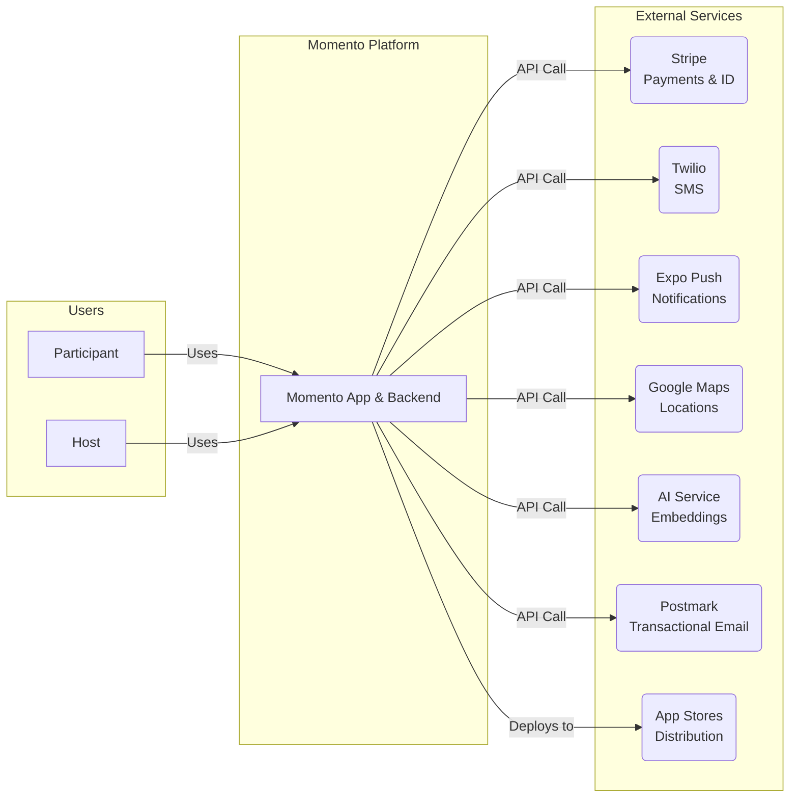
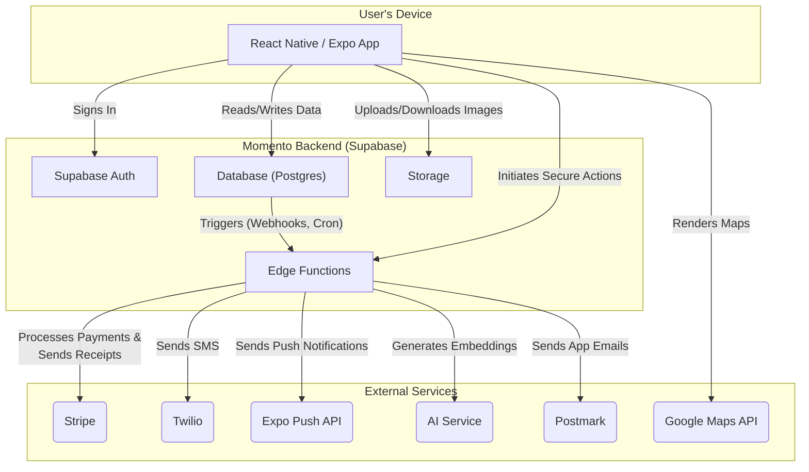

# Architecture & Diagrams

This document contains architectural diagrams to visualize component structures and data flows within the Momento application.

## 1. System Context Diagram

This diagram provides a high-level "map of the world" for the Momento ecosystem. It shows the key users who interact with our system and the primary external services that the Momento platform relies on to function. It is the best starting point for understanding the system's boundaries and its place in the broader digital environment.



## 2. Container Diagram

This diagram provides a more detailed "blueprint" of the Momento platform. It breaks down the high-level system into its major logical containers, showing how they interact with each other and which components are responsible for communicating with external services. This view is essential for developers to understand the technical structure of the application.



## 3. UI Architecture: Role-Based Navigation & Mode Switching

To provide a focused and intuitive experience for all user types, Momento's UI will be **role-based**. A user's account can have different roles (`Participant`, `Host`), and the app's interface, particularly the main tab bar navigation, will adapt to the role they are currently acting in.

This architecture solves the challenge of a user who is both a participant and a host, preventing cognitive overload by ensuring they only see the tools relevant to their current goal.

There are three primary user types:

1.  **Social-Only User (`Participant`)**: The default user who attends events. Their UI is focused on discovery and connection.
2.  **Host-Only User (`Community Host`)**: A business or organization whose goal is to create and manage events. Their UI is a streamlined professional dashboard. They do not have social features like a Memory Book.
3.  **Hybrid User (`User Host`)**: An individual who both hosts and participates in events. This user has access to both UI paradigms.

### The "Mode Switcher"

The lynchpin of this design is the **"Mode Switcher,"** a clear control within the `Profile` tab that allows a Hybrid User to toggle between "Social Mode" and "Host Mode."

- **Social Mode**: The UI is identical to the Social-Only user's experience.
- **Host Mode**: The UI transforms into the professional dashboard identical to the Host-Only user's experience.

This approach ensures that single-role users have a simple, dedicated experience, while hybrid users have the power to switch contexts without clutter.

## 4. Backend & Database Architecture

### Geospatial Indexing for Efficient Location Queries

A core feature of Momento's matching algorithm is filtering events based on a user's `distance_preference`. As the number of users and events grows, performing a naive distance calculation for every event for every user will become a significant performance bottleneck.

To solve this, we will leverage geospatial indexing in our PostgreSQL database (via Supabase).

1.  **Enable PostGIS Extension**: The first step is to enable the `postgis` extension in our Supabase instance, which provides powerful geospatial functions and data types.

2.  **Use Geographic Data Types**: In the `locations` table, we will store coordinates not as simple `float` columns, but as a single `geography` or `geometry` point. The `geography` type is often preferred as it accounts for the Earth's curvature, providing more accurate distance calculations over larger areas.

3.  **Create a GIST Index**: We will create a **GiST (Generalized Search Tree) index** on the new geospatial column. This type of index is specifically designed to accelerate spatial queries.

4.  **Efficient Queries**: With the index in place, we can use PostGIS functions like `ST_DWithin` to perform highly efficient searches. The query will look something like this:

    ```sql
    -- Find all events within 25 miles (approx. 40233.6 meters) of a user's location
    SELECT event.*
    FROM events
    JOIN event_itinerary_stops AS stops ON events.id = stops.event_id
    JOIN locations ON stops.location_id = locations.id
    WHERE ST_DWithin(
      locations.point,
      -- User's home location, cast to geography
      ST_MakePoint(user_longitude, user_latitude)::geography,
      -- Distance in meters
      40233.6
    );
    ```

This architectural decision is critical for ensuring the matching process remains fast and scalable as the platform grows. It allows the database to quickly eliminate the vast majority of events that are outside a user's radius, rather than calculating the distance for each one.
