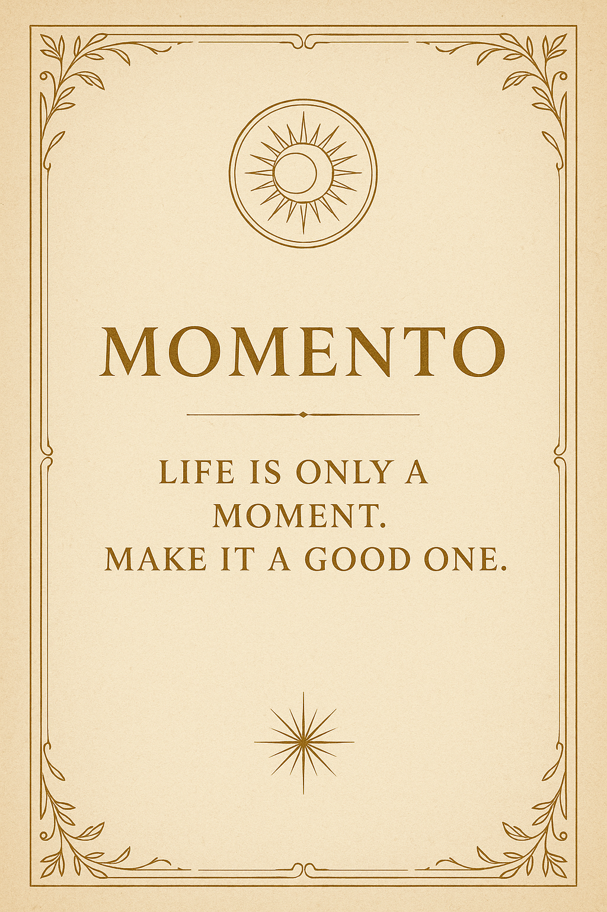

# Design System & Inspiration

This document outlines the visual and experiential aesthetic for the Momento application.

- **[Core Principles & UI/UX Concepts](#core-principles)**: Defines the "esoteric-tarot meets Art Deco" aesthetic, including line work, iconography, palettes, and concepts like the "foil-stamp" effect.
- **[Experiential Design Philosophy](#experiential-design-philosophy)**: Explains the core philosophy of treating the user journey as an "adventure, not a survey."
- **[Inspiration Title Screen](#inspiration-title-screen)**: A visual reference for the app's potential title screen aesthetic.
- **[Inspiration Board](#inspiration-board)**: A mood board capturing the overall design vibe.

---

**Note on MVP Implementation:** The concepts outlined in this document represent the long-term design vision for Momento. For the initial MVP, development will prioritize a clean, standard, and functional UI to ensure a solid foundation before layering in more complex and unique design elements.

The design aesthetic for Momento draws inspiration from a unique blend of sources, aiming for a style that feels like an "esoteric-tarot meets Art Deco mash-up."

**Inspirations:**

- The clean lines of games like Monument Valley and Gris.
- The intricate beauty of Islamic geometric tilework.

**Core Principles:**

- **Line Work & Symmetry:** Delicate line work and geometric symmetry (think gilded borders, concentric circles, stepped angles).
- **Iconography:** Celestial & botanical iconography (moons, stars, suns, vines) tucked into frame-like compositions.
- **Palettes:** Minimal palettes—mostly black/cream or kraft paper with pops of metallic-gold or muted jewel tones.
- **Vibes:** Architectural/blueprint vibes via tiny call-outs, numbering and diagrammatic strokes.

**UI/UX Concepts:**

- **Foil-Stamp Effect:** Utilizing subtle gold gradients on dark card elements to create a premium, tactile feel.
- **Animated Illustrations:** Animating lines to "draw" themselves in on hover or load, creating a "living blueprint" effect. This could be applied to event invitations, turning them into looping GIFs where elements like gold leaf filigree gently move or decorative lines sparkle. This is inspired by the "living photos" in Harry Potter.

---

## Experiential Design Philosophy

The user experience should be guided by a core philosophy: **this is an adventure, not a survey.** Every interaction, especially during onboarding, is an opportunity to communicate the value and soul of Momento.

The goal is to **immediately communicate that Momento is about high-quality, curated experiences, not just another "let's grab drinks" meetup app.** We want to make the user genuinely excited for their first real invitation from the moment they sign up. This principle informs features like the "Possibility Card" interest discovery flow, which should feel less like a questionnaire and more like a tantalizing glimpse into a world of future experiences.

## Inspiration Title Screen

## Inspiration Board

---
