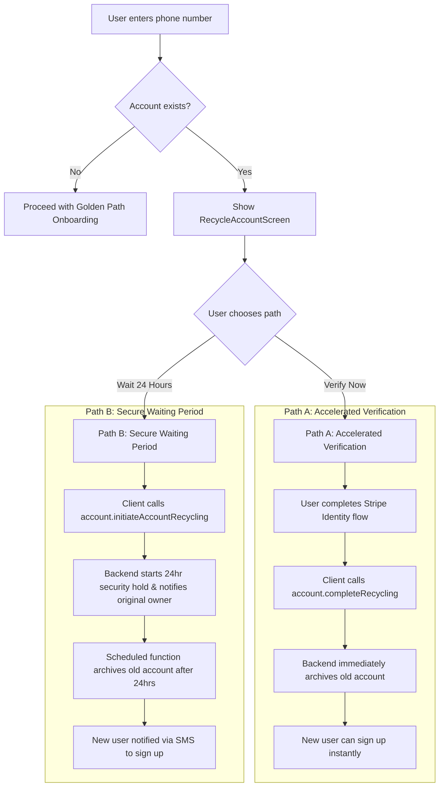

## 03: Handling a Recycled Phone Number (DEPRECATED)

**This flow is now deprecated.**

The complexity of securely handling recycled phone numbers is now managed by our third-party authentication provider, **Clerk**.

Clerk has built-in mechanisms to verify phone number ownership. If a user attempts to sign up with a number that is already in use, Clerk's flows will handle the process of verifying the new user and securing the original account. This removes the need for our own custom UI, backend logic, and multi-step user flows for this scenario.

**Actors:**

- **User:** The person trying to sign up.
- **Momento App (Client):** The React Native/Expo application.
- **Momento Backend (Convex):** The Convex server handling logic.
- **Stripe Identity:** Service for optional, instant identity verification.
- **Postmark/Twilio:** Services for sending notifications.

### High-Level Flow Diagram

---

### Flow Steps

The flow begins after the user enters their phone number on the initial sign-up screen.

#### 1. Account Conflict Detection

- **System Action:** This flow is triggered when the `auth.sendOtp` mutation discovers an existing `users` document with the provided `phone_number`.
- **Backend (Convex):** The backend returns a specific response to the client, e.g., `{ accountExists: true }`, instead of sending an OTP.

#### 2. Empowering the User with a Choice

- **User Experience (UI/UX):** The user is navigated to the `RecycleAccountScreen`.
  - The screen clearly explains the situation: "This phone number is associated with an existing account. To protect the original owner's privacy, we need to verify you're the new owner."
  - Two distinct choices are presented:
    - **Button 1: "Verify My Identity to Continue Now"** (Leads to Path A)
    - **Button 2: "Notify Me in 24 Hours"** (Leads to Path B)

---

### Path A: Accelerated Verification (Instant Access)

The user has selected **"Verify My Identity to Continue Now"**.

#### A1. Identity Verification

- **User Action:** The user taps the button and is guided into the Stripe Identity flow.
- **User Experience (UI/UX):** The app presents the native Stripe Identity SDK, prompting the user to scan their driver's license, passport, or other government-issued ID.
- **Client & Services:** The client handles the interaction with the Stripe SDK. Upon a successful verification result from Stripe, the client proceeds to the next step.

#### A2. Account Transition

- **System Action:** With identity confirmed, the client immediately calls the backend to finalize the account transition.
- **Backend (Convex):**
  - **Client -> Backend:** The client calls the `account.completeRecycling` mutation.
  - **Logic:**
    1.  This mutation archives the original `users` document (`status: 'archived_for_recycling'`, `phone_number: null`).
    2.  It may trigger a final "for your records" notification email to the original owner.
    3.  Crucially, it returns a success response to the client, signaling that the phone number is now free.
- **User Experience (UI/UX):** The user is seamlessly navigated back to the start of the sign-up flow (`PhoneInputScreen`) where they can now enter their number and proceed with onboarding without any conflict.

---

### Path B: Secure Waiting Period (Passive Path)

The user has selected **"Notify Me in 24 Hours"**.

#### B1. Initiating the Security Hold

- **User Experience (UI/UX):** The app navigates to the `SecurityHoldScreen`, which confirms their choice and explains the 24-hour waiting period. The message is reassuring and manages expectations.
- **Backend & Services:**
  - **Client -> Backend:** The client calls the `account.initiateAccountRecycling` mutation.
  - **Backend (Convex):**
    1.  Sends a critical warning email to the original account owner via Postmark, informing them of the pending change.
    2.  Creates a scheduled function (`account.archiveUserAfterHold`) to execute in 24 hours.

#### B2. Account Archival & Notification

- **System Action:** After 24 hours, the scheduled function runs.
- **Backend & Services:**
  1.  The function archives the original `users` account as described in Path A.
  2.  It then calls Twilio to send an SMS to the phone number: "Welcome to Momento! You can now complete your sign-up."
- **User Action:** The new user receives the SMS and can re-open the app to sign up.
- **User Experience (UI/UX):** Same as the final step in Path A. When the user enters their phone number, the path is now clear for them to create their account.
