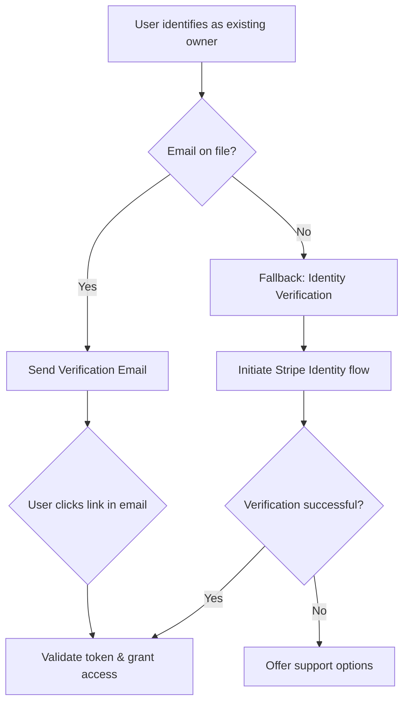

## 04: Account Recovery (DEPRECATED)

**This flow is now deprecated.**

The process of account recovery, such as when a user gets a new device, is now managed by our third-party authentication provider, **Clerk**.

Clerk handles session management and provides secure, standard methods for users to regain access to their accounts. This eliminates the need for our custom-built logic involving device history, email verification tokens, and fallback identity checks. Users will follow Clerk's standard recovery procedures.

**Goal:** To securely verify an existing user who is attempting to log in from a new, unrecognized device and grant them access to their account. A device is considered "unrecognized" if its app-install-specific UUID is not found in the user's `deviceHistory`.

**Actors:**

- **User:** The existing user.
- **Momento App (Client):** The React Native/Expo application.
- **Momento Backend (Convex):** The Convex server handling logic.
- **Postmark:** Used for sending the email verification link.
- **Stripe:** Can be used as a fallback for identity verification.

### High-Level Flow Diagram

---

### Flow Steps

This flow can be triggered in two ways:

1.  A user identifies themselves as the original owner during the "Recycled Phone Number" flow.
2.  A returning user attempts to log in, and the client, sending its device UUID, is told by the backend that the device is unrecognized.

#### 1. Initiate Second-Factor Authentication (2FA)

- **System Action:** The backend determines the best method for 2FA based on the user's available data.
- **Backend (Convex):**
  1.  The `auth.requestVerification` mutation is called.
  2.  It checks if a verified `email` exists in the `users` document.
  3.  **Path A:** If an email exists, it proceeds to the email verification step.
  4.  **Path B:** If no email exists, it proceeds to the fallback identity verification step.

---

### Path A: Email Verification (Primary Flow)

#### A1. Send Verification Link

- **User Experience (UI/UX):**
  - The app displays a message: "To protect your account, we've sent a verification link to the email address on file. Please check your inbox and click the link to continue."
- **Backend & Services:**
  - The `auth.requestVerification` mutation generates a secure, single-use, time-limited verification token.
  - It calls a Postmark `httpAction` to send an email containing a deep link to the user. The URL will look something like `momento://verify-device?token=...`.

#### A2. Validate Token & Grant Access

- **User Action:** User opens their email and taps the verification link.
- **System Action:** The operating system deep-links the user back into the Momento app.
- **User Experience (UI/UX):**
  - The app opens and displays a "Verifying..." or "Welcome back!" message.
  - The user is seamlessly logged in and redirected to the main app screen.
- **Backend & Services:**
  - **Client:** The app's root component or navigation container parses the `token` from the incoming deep link URL.
  - **Client -> Backend:** The client calls the `account.verifyDeviceToken({ token, deviceId })` mutation.
  - **Backend (Convex):**
    1.  The backend validates the token against the stored record, checking for expiry.
    2.  Upon success, it uses Convex's session management to authenticate the user.
    3.  It adds the new device's UUID (`deviceId`) to the `deviceHistory` array in the user's document.
    4.  Access is granted, and the client is now in an authenticated state.

---

### Path B: Fallback Identity Verification (No Email on File)

This is a critical edge case for when a user cannot be verified via email.

#### B1. Initiate Stripe Identity

- **User Experience (UI/UX):**
  - The app explains the situation: "We don't have an email on file for this account. To continue, we'll need to verify your identity."
  - The app then initiates the Stripe Identity native SDK flow.
- **Backend & Services:**
  - This flow mirrors the Identity Verification in the "Host Onboarding" flow. The backend creates a `VerificationSession` via Stripe, the client uses the session's secret to launch the SDK, and the backend listens for the `verified` webhook from Stripe.

#### B2. Grant Access on Success

- **User Experience (UI/UX):**
  - Once Stripe confirms verification (which may take a few moments), the app displays a success message and logs the user in.
- **Backend & Services:**
  - Upon receiving the successful `verification_session.verified` webhook, the backend can confidently use Convex's session management to authenticate the user and update the `deviceHistory`, granting the user access.

#### B3. Handle Verification Failure

- **User Experience (UI/UX):**
  - If Stripe Identity verification fails, the app must gracefully handle it.
  - A message is displayed: "We were unable to verify your identity at this time. Please contact support for further assistance." A button linking to the support flow is provided.
- **System Action:** The user is not granted access. This is a critical security stopgap to prevent unauthorized account takeovers.
