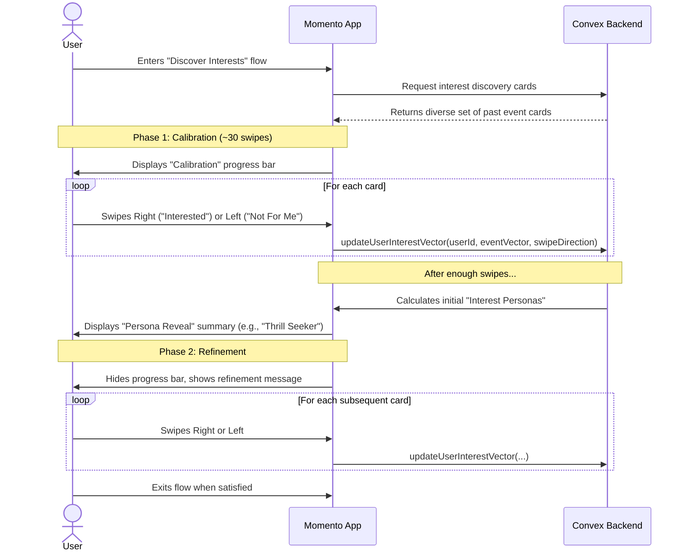

# 14. Discovering Your Interests

This user flow details the "Interest Discovery" experience, a core feature designed to build a deep, vector-based understanding of a user's tastes. The flow is intentionally designed to feel like a game of discovery rather than a survey.

- **Actors**: `New User` (during onboarding) or `Existing User` (via the Discovery Tab).
- **Goal**: To build and refine the user's `positive_` and `negative_interest_vectors` to power the event matching algorithm.

---

## The Flow

## Step-by-Step Description

1.  **Entry Point**: A `New User` enters this flow as a final step of onboarding. An `Existing User` can access it at any time from the `Discovery` tab to refine their tastes.
2.  **Phase 1: The Calibration Phase**:
    - The user is presented with a full-screen, swipeable deck of "Possibility Cards." These cards represent real, highly-rated past events, showcasing the quality of experiences on Momento.
    - A `CalibrationProgressBar` is displayed with an encouraging message like, _"Help us chart your map of interests. The more you swipe, the better our recommendations."_
    - For the first ~30 swipes, the cards are deliberately diverse to establish a broad baseline of the user's tastes.
    - With each swipe, the app sends the corresponding event's vector to the backend, which updates the user's `positive_interest_vector` (on a right swipe) or `negative_interest_vector` (on a left swipe).
3.  **The Persona Reveal Moment**:
    - After the calibration phase is complete, the app presents a moment of insight.
    - It displays the `PersonaRevealSummary` component, showing 1-3 "Interest Personas" the algorithm has identified (e.g., _"Fascinating! It looks like you have a few different sides to you. We're seeing a pattern around 'Thrill Seeker' and 'Cozy Creative'."_). This transforms the experience from a simple quiz into an act of self-discovery.
4.  **Phase 2: The Refinement Phase**:
    - The progress bar is replaced with a message indicating the main task is complete, but refinement is encouraged (e.g., _"Your map is charted! Keep swiping anytime to refine your tastes."_).
    - The cards shown are now more targeted, focusing on events similar to the user's discovered personas, with occasional "wild cards" sprinkled in to allow for continued exploration.
    - The user can continue swiping as much as they like and can exit the flow at any time.
