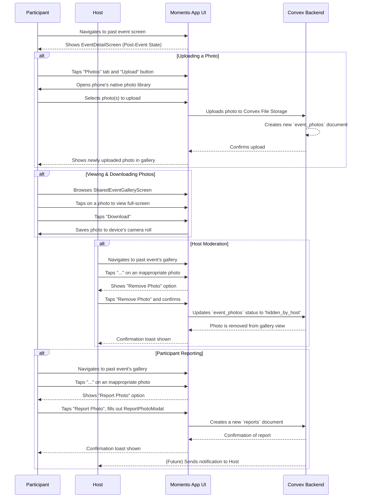

# 16. Managing Photos in a Shared Event Gallery

This document outlines the user flow for interacting with the shared photo gallery after an event has concluded. This feature is designed to extend the life of an event by creating a collaborative space for attendees to share their collective memories.

- **See Also:**
  - **Features:** `_docs/FEATURES.md` (Sections: [11. Shared Event Galleries & Camera Roll](#11-shared-event-galleries--camera-roll), [12. User Safety: Blocking & Reporting](#12-user-safety-blocking--reporting))
  - **UI:** `_docs/SCREENS_AND_COMPONENTS.md` (Screens: `EventDetailScreen` (Post-Event State), `SharedEventGalleryScreen`, `ReportPhotoModal`; Components: `CameraRollScreen`)
  - **Data Model:** `_docs/CONVEX_DATA_MODELS.md` (Collections: `event_photos`, `reports`)

---

## 1. Actors

- **Participant**: An authenticated user who has been successfully checked in and marked as `attended` for a past event.
- **Host**: The user or organization that created and managed the event.

## 2. Goal

- **Participant**: To upload photos from a personal device to a shared event gallery, view photos uploaded by other attendees, and download desired images.
- **Host**: To moderate the shared gallery by removing inappropriate or unwanted photos.
- **System**: To provide a private, secure, and collaborative space for sharing event memories.

## 3. Preconditions

- The event's `status` is `completed`.
- The user's `attendance` record for the event is marked as `attended`. This is typically confirmed after post-event feedback is submitted.

## 4. User Flow Diagram (Mermaid)

## 5. Step-by-Step Breakdown

### 5.1. Participant Experience

1.  **Accessing the Gallery**:

    - After an event is over and the user has submitted feedback, a **"Photos"** tab becomes visible on the `EventDetailScreen` for that event.
    - The user taps this tab to navigate to the `SharedEventGalleryScreen`.

2.  **Uploading Photos**:

    - On the `SharedEventGalleryScreen`, the user taps an "Upload" button.
    - The app requests permission (if needed) and opens the phone's native image library.
    - The user selects one or more photos.
    - The app uploads the selected image(s) to **Convex File Storage**.
    - For each successful upload, a new document is created in the `event_photos` collection with the `uploaderId` set to the current user.
    - The UI updates to show the new photos in the gallery grid.

3.  **Viewing and Downloading**:

    - The `SharedEventGalleryScreen` displays all `event_photos` with a `status` of `'visible'` as a grid of thumbnails.
    - The user can tap any photo to view it full-screen.
    - From the full-screen view, the user can tap a "Download" icon to save the image to their device.
    - They also have the option to download the entire album as a `.zip` file.

4.  **Reporting a Photo**:
    - If a user finds a photo inappropriate, they can tap a menu icon on the photo.
    - This opens a menu with a **"Report Photo"** option, which launches the `ReportPhotoModal`.
    - The user fills out a brief reason for the report.
    - On submission, a new document is created in the `reports` collection, linked to the `reporterId`, the `uploaderId` (of the photo), and the specific `event_photos` ID.
    - The report is sent to a moderation queue for review.

### 5.2. Host Experience

1.  **Accessing the Gallery**:

    - The Host accesses the gallery for their event in the same way a participant does, via the "Photos" tab on the `EventDetailScreen`.

2.  **Moderating Photos**:
    - As the event host, when they tap the menu icon on any photo in the gallery, they see an additional option: **"Remove Photo"**.
    - If they tap "Remove Photo," a confirmation dialog appears.
    - Upon confirmation, the backend function updates the `status` of the corresponding `event_photos` document to `'hidden_by_host'`.
    - The photo is immediately filtered out and no longer appears in the `SharedEventGalleryScreen` for any user.

## 6. Postconditions

- **Success**:
  - The participant's selected photos are visible in the shared gallery.
  - The participant has successfully downloaded a photo to their device.
  - The host has successfully removed an unwanted photo from the gallery.
  - A participant's report has been successfully logged in the system.
- **Failure**:
  - A network error prevents a photo from uploading. The UI should show an error state and allow the user to retry.
  - The user lacks sufficient storage on their device to download a photo. The OS will handle this error message.
