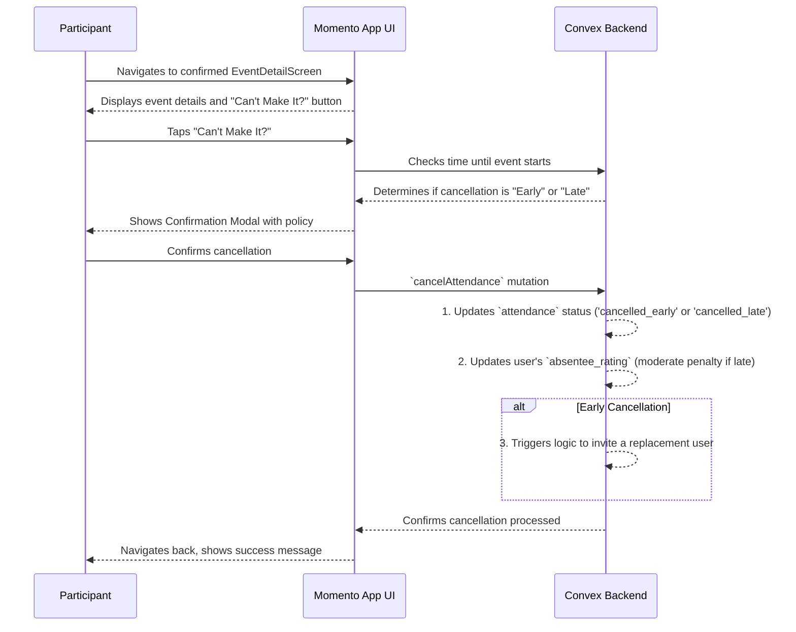

# 18. Cancelling Event Attendance

This document outlines the user flow for when a participant, who has already confirmed and paid for an event, decides to cancel their attendance. This flow is critical for managing community reliability and setting clear expectations.

- **See Also:**
  - **Features:** `_docs/FEATURES.md` (Section: [12. Community Reliability: Cancellations & No-Shows](#community-reliability-cancellations--no-shows))
  - **UI:** `_docs/SCREENS_AND_COMPONENTS.md` (Screen: `EventDetailScreen`)
  - **Data Model:** `_docs/CONVEX_DATA_MODELS.md` (Collections: `attendance`, `users` (specifically `internalMetrics.absentee_rating`))

---

## 1. Actor

- **Participant**: An authenticated user who has a `confirmed` invitation and a corresponding `attendance` record for an upcoming event.

## 2. Goal

- To allow a user to officially withdraw from an event they can no longer attend, providing a clear signal to the system and the host.
- To enforce the community policy regarding cancellations and update the user's internal reliability score accordingly.

## 3. Preconditions

- The user has a `confirmed` invitation for an event.
- The event has not yet started.

## 4. User Flow Diagram (Mermaid)

## 5. Step-by-Step Breakdown

1.  **Initiating Cancellation**:

    - The user navigates to the `EventDetailScreen` for an upcoming event they are confirmed for.
    - They tap a button prominently labeled **"Can't Make It?"** or **"Cancel My Spot"**.

2.  **Confirmation and Policy Display**:

    - Tapping the button launches a confirmation modal.
    - The modal's content is dynamic based on the time remaining until the event:
      - **Policy Reminder**: It clearly states that the **$5 Confirmation Fee is non-refundable**.
      - **Early Cancellation (> 24 hours before start)**: The message is reassuring. _"Plans change! Thanks for letting us know early. Your $5 fee is non-refundable, but this won't affect your community standing."_
      - **Late Cancellation (< 24 hours before start)**: The message is more direct. _"This is a late cancellation. Your $5 fee is non-refundable and this will be noted to help us build a reliable community. Are you sure?"_

3.  **Confirming the Action**:

    - The user must tap a final "Confirm Cancellation" button to proceed.

4.  **Backend Processing**:

    - The client calls a `cancelAttendance` Convex mutation.
    - The backend performs the following actions:
      1.  **Updates `attendance` status**: The `status` field on the user's `attendance` document for this event is updated to either `'cancelled_early'` or `'cancelled_late'`.
      2.  **Updates Reliability Score**: If the cancellation was late, a **moderate penalty** is applied to the user's `internalMetrics.absentee_rating`. Early cancellations have no penalty.
      3.  **Triggers Replacement Logic (Early Cancellation only)**: If the cancellation was early, the backend may trigger a process to send a new, time-sensitive invitation to another well-matched user to fill the now-vacant spot. This logic is not triggered for late cancellations.

5.  **Final UI Feedback**:
    - The user is returned to their main event list or home screen.
    - A confirmation toast message appears, e.g., "Your cancellation has been confirmed."
    - The event no longer appears in their "Upcoming" or "Confirmed" list.

## 6. Postconditions

- **Success**:
  - The user's `attendance` record for the event is updated to reflect the cancellation.
  - The user's internal `absentee_rating` is updated if the cancellation was late.
  - The user no longer sees the event in their confirmed list.
  - The system may have initiated a new invitation to fill the spot.
- **Failure**:
  - A network error prevents the cancellation from being processed. The UI should inform the user and allow them to retry.
  - The user attempts to cancel after the event has already started. The option should be disabled in the UI.
