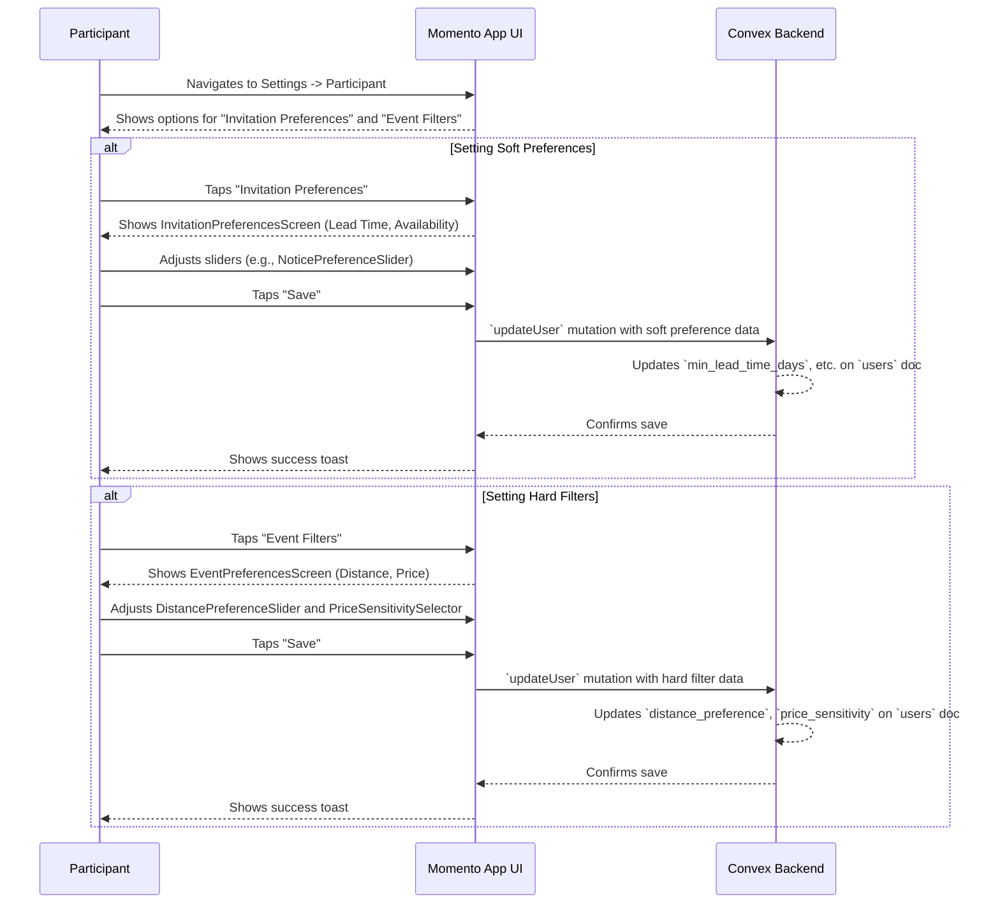

# 21. Invitation & Event Preferences

This document outlines the user flow for setting both "soft" and "hard" preferences that govern the types of event invitations a user receives. This feature is key to personalization, reducing noise and ensuring invitations are highly relevant to a user's real-world constraints and schedule.

- **See Also:**
  - **Features:** `_docs/FEATURES.md` (Section: [7. Event Preferences & Filtering](#7-event-preferences-filtering))
  - **UI:** `_docs/SCREENS_AND_COMPONENTS.md` (Screens: `InvitationPreferencesScreen`, `EventPreferencesScreen`; Components: `NoticePreferenceSlider`, `DistancePreferenceSlider`, etc.)
  - **Data Model:** `_docs/CONVEX_DATA_MODELS.md` (Collection: `users`)
  - **Algorithm:** `_docs/MATCHING_ALGORITHM.md` (Section: Lead-Time & Availability Scoring)

---

## 1. Actor

- **Participant**: An authenticated user with a `socialProfile`.

## 2. Goal

- To give users granular control over the logistics of event invitations, such as timing, distance, and cost.
- To improve the quality of event matches by allowing the algorithm to filter or penalize invitations that don't meet a user's preferences.

## 3. Preconditions

- The user is logged in and navigates to their settings. The UI is split into two distinct screens under the "Participant" settings tab to separate soft preferences from hard filters.

## 4. User Flow Diagram (Mermaid)

## 5. Step-by-Step Breakdown

### 5.1. Setting "Soft" Invitation Preferences

This flow governs preferences that the matching algorithm will treat as strong suggestions, applying a "penalty" to events that don't align.

1.  **Navigation**: The user navigates to `SettingsScreen` -> `Participant (Tab)` -> `InvitationPreferencesScreen`.
2.  **Setting Preferences**: The screen contains several controls:
    - **`NoticePreferenceSlider`**: A slider to set the ideal minimum lead-time for invitations (e.g., 0-14 days).
    - **`DayWeekendToggle`**: A simple toggle for high-level "Weekday" vs. "Weekend" availability.
    - **`AvailabilityGrid` (Advanced)**: A more granular 7x2 grid to set specific day/night availability.
3.  **Saving**: The user adjusts the controls and taps "Save".
4.  **Backend Update**: An `updateUser` mutation is called, which updates the `min_lead_time_days` and `availability_preferences` fields on the user's document in the `users` collection.
5.  **Matching Impact**: The matching algorithm uses these values to calculate an `AvailabilityPenalty` and `LeadTimePenalty`, which reduces the match score for non-aligned events, making them less likely to be sent.

### 5.2. Setting "Hard" Event Filters

This flow governs preferences that the matching algorithm will treat as strict rules, filtering out any non-compliant events entirely.

1.  **Navigation**: The user navigates to `SettingsScreen` -> `Participant (Tab)` -> `EventPreferencesScreen`.
2.  **Setting Filters**: The screen contains controls for non-negotiable filters:
    - **`DistancePreferenceSlider`**: A slider to set the maximum travel distance for events (e.g., 1-25 miles).
    - **`PriceSensitivitySelector`**: A segmented control to set the maximum price comfort level (`$`, `$$`, `$$$`, `$$$$`).
3.  **Saving**: The user adjusts the controls and taps "Save".
4.  **Backend Update**: An `updateUser` mutation is called, updating the `distance_preference` and `price_sensitivity` fields on the user's document.
5.  **Matching Impact**: The matching algorithm uses these values as **hard filters** at the very beginning of the candidate generation process, immediately excluding any events that are too far away or too expensive.

## 6. Postconditions

- **Success**:
  - The relevant fields (`distance_preference`, `price_sensitivity`, `min_lead_time_days`, etc.) are updated on the user's document in the `users` collection.
  - Future event invitations will be more closely aligned with the user's stated logistical and financial constraints.
- **Failure**:
  - A network error prevents the preferences from saving. The UI should show an error and allow the user to retry.
