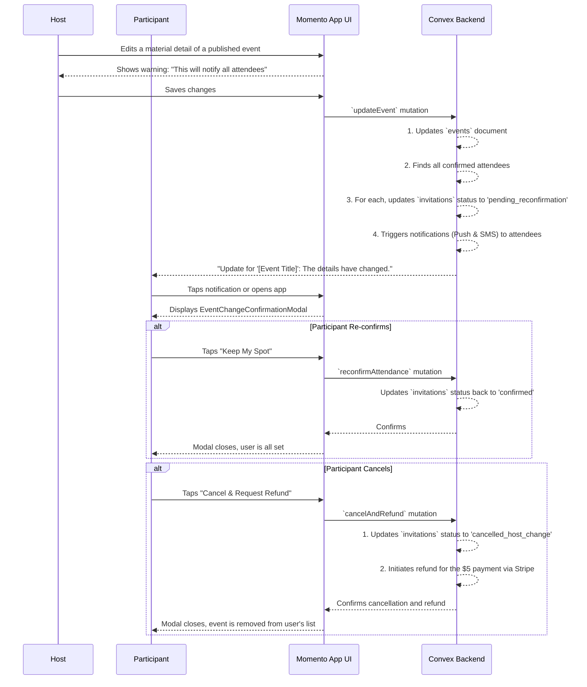

# 19. Handling Host-Initiated Event Changes

This document outlines the critical user flow for managing material changes made by a host to an event that already has confirmed participants. This flow is designed to protect user trust by ensuring transparency and providing a clear path to a refund if the new event details no longer work for the attendee.

- **See Also:**
  - **Features:** `_docs/FEATURES.md` (Section: [12. Community Reliability: Cancellations & No-Shows](#community-reliability-cancellations--no-shows))
  - **UI:** `_docs/SCREENS_AND_COMPONENTS.md` (Modals: `EventChangeConfirmationModal`)
  - **Data Model:** `_docs/CONVEX_DATA_MODELS.md` (Collections: `invitations`, `payments`)
  - **Notifications:** `_docs/NOTIFICATIONS_PLAN.md`

---

## 1. Actors

- **Host**: The user who created the event.
- **Participant**: An authenticated user who has a `confirmed` invitation for the event being changed.

## 2. Goal

- To inform confirmed attendees about significant changes to an event's logistics or content.
- To give attendees the agency to either accept the new terms or cancel their attendance and receive a full refund of their **$5 Confirmation Fee**.
- To maintain community trust by handling these exceptions fairly and transparently.

## 3. Preconditions

- An event is `published` and has one or more participants with a `confirmed` status.
- The Host edits a "material" detail of the event. Material changes include:
  - Date or Start Time
  - Location / Itinerary Stop
  - Significant change in description or title
  - Change in `min_age` requirement

## 4. User Flow Diagram (Mermaid)

## 5. Step-by-Step Breakdown

### 5.1. Host Experience

1.  **Editing the Event**: The Host navigates to their `ManageEventScreen` and makes a material change to an upcoming event.
2.  **System Warning**: Before saving, the UI presents a clear warning: _"You've changed a key detail for this event. All confirmed attendees will be notified and asked to re-confirm their spot. Are you sure?"_
3.  **Saving and Triggering**: The Host confirms the change. The `updateEvent` mutation is called on the backend.

### 5.2. Backend Processing

1.  **Update Event**: The backend first updates the `events` document with the new information.
2.  **Identify Attendees**: It queries for all `invitations` linked to this `eventId` with a `status` of `'confirmed'`.
3.  **Update Status**: For each of these invitations, the backend atomically updates their `status` to `'pending_reconfirmation'`. This is a temporary state that signifies the user must take action.
4.  **Send Notifications**: The backend triggers a high-priority notification to each affected user via Push and/or SMS, as per their preferences. The message content is clear: _"Update for '[Event Title]': The details have changed. Please review and confirm your spot."_

### 5.3. Participant Experience

1.  **Receiving Notification**: The participant receives the notification and taps it, deep-linking them to the `EventDetailScreen`.
2.  **Forced Choice Modal**: Upon arrival at the screen (or upon next app open if they miss the notification), the system detects their `'pending_reconfirmation'` status and immediately presents the `EventChangeConfirmationModal`. This modal is blocking; they cannot interact with the rest of the screen until they make a choice.
3.  **Reviewing Changes**: The modal clearly displays the change. For example:
    - **"Event Time has Changed"**
    - **Old:** Tuesday, 8:00 PM
    - **New:** Wednesday, 7:00 PM
4.  **Making a Decision**: The modal presents two clear options:
    - **"Keep My Spot"**: The user accepts the new terms. A `reconfirmAttendance` mutation is called, changing their `invitations.status` back to `'confirmed'`. The modal closes, and they can view the event details as normal.
    - **"Cancel & Request Refund"**: The user does not accept the new terms. A `cancelAndRefund` mutation is called.
      - The `invitations.status` is changed to `'cancelled_host_change'`.
      - The backend initiates a refund of the original `$5 Confirmation Fee` via the Stripe API.
      - The event is removed from the user's list of upcoming events.

## 6. Postconditions

- **Success (Re-confirm)**:
  - The participant's `invitations` status is `confirmed`.
  - They remain an attendee for the event under the new terms.
- **Success (Cancel)**:
  - The participant's `invitations` status is `cancelled_host_change`.
  - A refund process for their `$5 fee` has been initiated.
  - The user is no longer an attendee.
  - The host sees the updated attendee count.
- **Failure**:
  - If the refund API call fails, the system must have a retry mechanism or flag the payment for manual review to ensure the user is not incorrectly charged.
