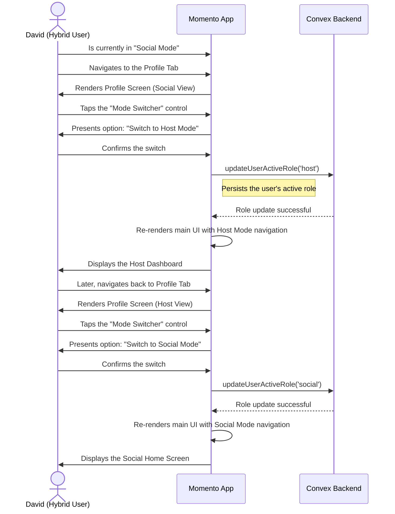

# 10. Switching Between Social & Host Modes

This user flow describes how a `Hybrid User` (an individual who is both a `Participant` and a `Host`) switches between the app's two primary interfaces: "Social Mode" and "Host Mode." This functionality is key to providing a focused, uncluttered experience for users who wear multiple hats in the Momento ecosystem.

- **Actor**: A `Hybrid User` (e.g., "David, the Curator").
- **Goal**: To switch from the social-focused experience to the host management dashboard, and back again, to manage different aspects of their Momento activity.

---

## The Flow

## Step-by-Step Description

1.  **Starting Point**: The user, who is both a participant and a host, is currently using the app in "Social Mode." The main tab bar shows options like `Home`, `Events`, `Memory Book`, etc.
2.  **Accessing the Switcher**: The user decides to check on an event they are hosting. They navigate to their `Profile` tab.
3.  **Initiating the Switch**: On their profile screen, they locate and tap the "Mode Switcher" control.
4.  **Confirmation**: The app presents a clear option, such as "Switch to Host Mode." The user confirms their choice.
5.  **Backend Update**: The app sends a request to the backend to update the user's `active_role` in their `users` document to `'host'`. This ensures the choice persists across sessions.
6.  **UI Transformation**: Upon successful confirmation from the backend, the app's entire navigational structure re-renders. The main tab bar now shows the "Host Mode" layout: `Dashboard`, `Events`, `Inbox`, and `Profile`.
7.  **Host Experience**: The user is now in "Host Mode" and can access all their hosting tools, view their event dashboard, manage attendees, and respond to messages from participants.
8.  **Switching Back**: To return to the social experience, the user navigates to their `Profile` tab within Host Mode and uses the same "Mode Switcher" control to select "Switch to Social Mode," repeating the process to set their `active_role` back to `'social'`.
