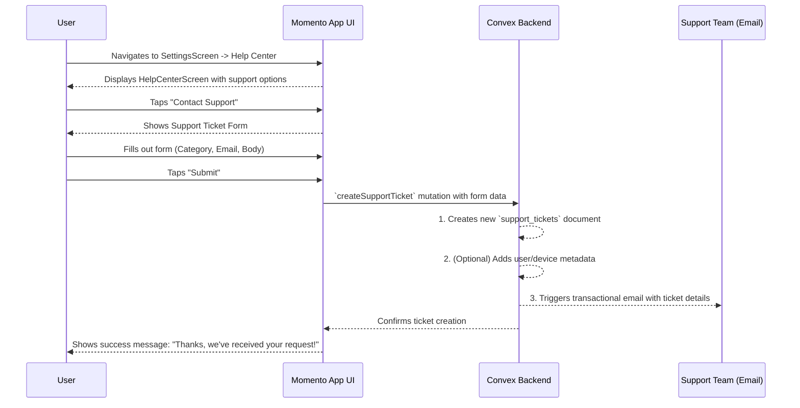

# 20. Contacting Support

This document outlines the user flow for when a user needs to contact the Momento support team for help with technical issues, payment disputes, or other questions.

- **See Also:**
  - **UI:** `_docs/SCREENS_AND_COMPONENTS.md` (Screens: `SettingsScreen`, `HelpCenterScreen`)
  - **Data Model:** `_docs/CONVEX_DATA_MODELS.md` (Collections: `support_tickets`)

---

## 1. Actor

- **User**: Any authenticated Momento user (Participant or Host).

## 2. Goal

- To provide a structured, in-app channel for users to submit support requests.
- To gather sufficient information for the support team to effectively diagnose and resolve the user's issue.
- To confirm to the user that their request has been received.

## 3. Preconditions

- The user is logged into their Momento account.

## 4. User Flow Diagram (Mermaid)

## 5. Step-by-Step Breakdown

1.  **Accessing the Help Center**:

    - The user navigates to the main `SettingsScreen`.
    - Within the "Account" tab, they find and tap on the **`HelpCenterScreen`** option.

2.  **Initiating Contact**:

    - The `HelpCenterScreen` may contain FAQs or links to documentation. It will feature a clear call-to-action button such as **"Contact Support"**.
    - The user taps this button to open the support ticket submission form.

3.  **Submitting the Ticket**:

    - The user is presented with a structured form containing the following fields:
      - **`reply_to_email`**: An email address field, pre-filled with the user's account email if available.
      - **`category`**: A dropdown/picker for classifying the issue (e.g., "Payment Question," "Technical Problem," "Report a Bug," "General Feedback"). This helps with routing.
      - **`body`**: A multi-line text area for the user to describe their issue in detail.
      - **`associated_event_id` (Optional)**: A way to link the ticket to a specific event, which can be auto-suggested based on recent activity.
    - The user fills out the form and taps **"Submit"**.

4.  **Backend Processing**:

    - The client calls a `createSupportTicket` Convex mutation, passing along the form data.
    - The backend performs the following actions:
      1.  **Create Ticket**: It creates a new document in the `support_tickets` collection.
      2.  **Enrich Data**: The backend automatically enriches the ticket with useful diagnostic `metadata`, such as the user's ID, app version, and device type.
      3.  **Notify Support Team**: It uses a service like **Postmark** to send a formatted email containing all the ticket information to the internal support desk (e.g., `support@momento.app`).

5.  **Confirmation**:
    - Upon successful creation, the UI displays a confirmation message to the user, such as: _"Your request has been received. We'll get back to you at the email provided as soon as possible."_
    - The user may also receive an automated email receipt confirming their ticket was logged.

## 6. Postconditions

- **Success**:
  - A new document exists in the `support_tickets` collection with all the relevant information.
  - The Momento support team has received an email with the details of the user's request.
  - The user has received confirmation that their request was submitted successfully.
- **Failure**:
  - A network error prevents the form submission. The UI should display an error and allow the user to retry without losing their typed input.
