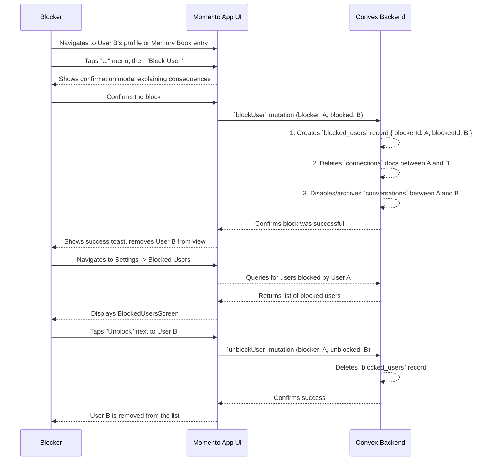

# 24. User Safety: Blocking Another User

This document outlines the user flow for the "Block" feature, a critical safety tool that allows a user to completely and silently sever all digital interaction with another user on the platform.

- **See Also:**
  - **Features:** `_docs/FEATURES.md` (Section: [12. User Safety: A Three-Tiered System](#a-three-tiered-system))
  - **UI:** `_docs/SCREENS_AND_COMPONENTS.md` (Screens: `ConnectionDetailScreen`, `UserProfileScreen`, `BlockedUsersScreen`; Modals: `ReportAndBlockModal`)
  - **Data Model:** `_docs/CONVEX_DATA_MODELS.md` (Collections: `blocked_users`, `connections`, `conversations`)

---

## 1. Actors

- **User A (The Blocker)**: Any authenticated user.
- **User B (The Blocked)**: The user being blocked.

## 2. Goal

- To give a user a powerful, immediate, and silent tool to stop all current and future interactions with another user.
- To ensure the blocker's safety and comfort without notifying the blocked user.

## 3. Preconditions

- User A has encountered User B, either in person at an event (and has their `FaceCard` in their Memory Book) or is viewing their public `UserProfileScreen`.

## 4. User Flow Diagram (Mermaid)

## 5. Step-by-Step Breakdown

### 5.1. Blocking a User

1.  **Initiating the Block**:

    - User A finds User B's profile via the `MemoryBook` (`ConnectionDetailScreen`) or their public `UserProfileScreen`.
    - User A taps a "..." menu icon, which reveals several options, including **"Block [User B's Name]"**. This may be part of a `ReportAndBlockModal` that presents "Block" and "Report" as separate actions.

2.  **Confirmation**:

    - Selecting "Block" presents a confirmation modal.
    - The modal clearly explains the consequences: _"Are you sure you want to block [User B's Name]? You will no longer see each other or be placed in events together. They will not be notified."_

3.  **Backend Action**:

    - User A confirms. The client calls a `blockUser` Convex mutation.
    - The backend executes a series of actions:
      1.  Creates a new document in the `blocked_users` collection: `{ blockerId: 'ID_of_A', blockedId: 'ID_of_B' }`.
      2.  Finds and deletes any `connections` documents where the `ownerId` and `connectedUserId` are A and B, effectively removing them from each other's Memory Books.
      3.  Finds any `conversations` between A and B and disables them (e.g., archives the conversation or removes the participants).
      4.  The matching algorithm and any queries for user-generated content (profiles, photos, etc.) must be designed to **always** query the `blocked_users` table and exclude results where a block exists in **either direction**. For example, a query for User A's feed should exclude content from User B if a record exists where `(blockerId: A, blockedId: B)` OR `(blockerId: B, blockedId: A)`.

4.  **UI Feedback**:
    - The UI confirms the block was successful with a toast message.
    - User B's profile or Face Card is removed from User A's view.

### 5.2. Managing Blocked Users (Unblocking)

1.  **Navigation**: At a later time, User A can navigate to `SettingsScreen` -> `Security & Privacy` -> `BlockedUsersScreen`.
2.  **Viewing Block List**: This screen queries the backend for all `blocked_users` documents where the `blockerId` matches User A's ID. It displays a list of all users they have blocked.
3.  **Unblocking**: Each user in the list has an "Unblock" button next to their name. User A taps this button.
4.  **Backend Action**: A `unblockUser` mutation is called, which finds and deletes the corresponding document from the `blocked_users` collection.
5.  **UI Feedback**: User B is removed from the list on the `BlockedUsersScreen`. User A and User B can now potentially see each other's content and be matched in future events. Their previous connection and message history are **not** restored.

## 6. Postconditions

- **Success (Block)**:
  - A `blocked_users` record is created.
  - User A and User B cannot see or interact with each other.
  - They will never be matched in a future event.
  - The blocked user is not notified of the action.
- **Success (Unblock)**:
  - The `blocked_users` record is deleted.
  - The two users are no longer actively prevented from interacting or being matched.

## 7. Edge Cases & Special Scenarios

### 7.1. Blocking in the Context of an Upcoming Event

- **Scenario**: User A tries to block User B, but they are both confirmed attendees for the same upcoming event.
- **System Rule**: To prevent logistical complexity and potential real-world awkwardness, this action is not allowed.
- **User Experience**:
  - The `blockUser` mutation fails with a specific error code (e.g., `upcoming_event_conflict`).
  - The UI catches this error and displays the `BlockActionErrorModal`.
  - The modal informs the user why the block cannot be performed at this time and presents them with two choices: "Cancel Attendance" or "OK". This gives the user agency while protecting the integrity of the event.

</rewritten_file>
