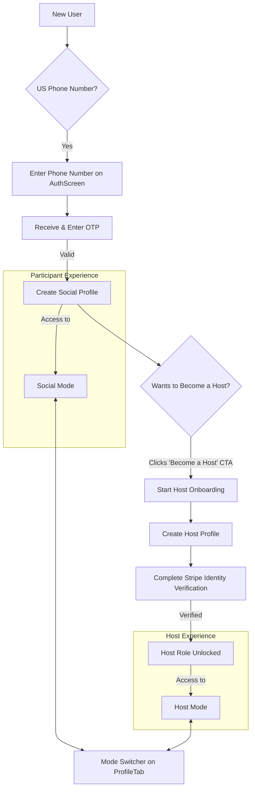

# 1. Title: PRD for Foundational User & Host Lifecycle

<version>1.0.0</version>

## Status: Draft

## Intro

This document outlines the Product Requirements for the **Foundational User & Host Lifecycle** epic. This is the first and most critical epic for Momento, establishing the core user-facing functionality that allows the platform to exist.

The primary goal is to build the essential pathways for a user to join Momento and for a participant to become a host. This includes phone-based authentication, creation of social and host profiles, a mandatory safety verification gate for all hosts, and the UI mechanism for hybrid users to switch between their roles. Successfully implementing this epic will provide the foundational components upon which all other features—like event creation, matching, and social interaction—will be built.

## Goals

- **Clear Project Objectives:**
  - Implement a secure, US-only, phone-based authentication system.
  - Establish the data models and UI flows for creating basic social and host profiles.
  - Integrate a mandatory identity verification system for all hosts to ensure community safety.
  - Develop a seamless "mode-switching" experience for users who are both participants and hosts.
- **Measurable Outcomes:**
  - A new user can successfully sign up with a valid US phone number and create a social profile.
  - An existing user can successfully navigate the host onboarding flow and create a host profile.
  - A host can successfully complete identity verification via Stripe Identity.
  - A user with both profiles can switch between "Social Mode" and "Host Mode."
- **Success Criteria:**
  - The host verification gate must be 100% effective; no event can be published by an unverified host.
  - The user sign-up success rate should be above 95% for individuals with valid US phone numbers.
  - The mode-switcher component correctly re-renders the app's navigation and context in 100% of cases.
- **Key Performance Indicators (KPIs):**
  - Number of new user sign-ups per week.
  - Percentage of new users who complete their social profile.
  - Number of participants who initiate the host onboarding flow.
  - Conversion rate of host onboarding (from start to verification complete).
  - Average time to complete host verification.

## Features and Requirements

- **Functional Requirements:**
  - Phone-first authentication using One-Time Passwords (OTPs) via SMS.
  - Sign-up restricted to US phone numbers, with a waitlist for international numbers.
  - Post-authentication flow to create a `socialProfile` with a name and profile photo.
  - A "Become a Host" CTA on the `ProfileTab` that initiates the host onboarding flow.
  - Creation of a `hostProfile` for users who complete host onboarding.
  - Integration with Stripe Identity for mandatory host verification.
  - A backend gate preventing unverified hosts from publishing events (i.e., changing event status from `draft` to `published`).
  - A `ModeSwitcher` UI component for users with both `socialProfile` and `hostProfile` to toggle the `users.active_role`.
- **Non-Functional Requirements:**
  - All user data, especially phone numbers and identity information, must be stored securely.
  - The authentication system must be scalable to handle concurrent sign-up requests.
  - The Stripe Identity integration must handle various states, including success, failure, and pending.
- **User Experience Requirements:**
  - A smooth, low-friction onboarding experience for new users.
  - Clear, confidence-inspiring UI and instructions during the host identity verification process.
  - The mode-switching interaction should be intuitive and provide immediate feedback by changing the app's context.

## Epic List

This PRD concerns the primary epic. Future or related epics can be listed here for context.

- **This Epic**: `001: Foundational User & Host Lifecycle`
- **Future Epic**: `002: End-to-End Event Lifecycle (Host & Participant)`

---

## Story List for this Epic

This section breaks the epic into concrete, implementable stories.

- **Story 001-01: User Authentication Setup**
  - **Goal**: Implement US-only, phone-based authentication using One-Time Passwords (OTP) sent via SMS.
- **Story 001-02: Social Profile Creation**
  - **Goal**: Allow new users to create a basic social profile with their name and a profile photo immediately after successful authentication.
- **Story 001-03: User Host Onboarding Flow**
  - **Goal**: Create a flow for existing participant users to become hosts, which results in the creation of a basic host profile.
- **Story 001-04: Host Verification with Stripe Identity**
  - **Goal**: Integrate Stripe Identity to verify hosts and enforce this check on the backend before an event can be published.
- **Story 001-05: Hybrid User Mode-Switching**
  - **Goal**: Implement a UI control and the corresponding backend logic for users with both social and host roles to switch between the two contexts.

## Strategic Context & Core Documents

To fully understand the scope and architectural impact of this epic, the following core project documents should be consulted. They can be found in the root `/_docs` directory.

- **Architecture:** `/_docs/ARCHITECTURE.md`
- **Development Process & Structure:** `/_docs/DEVELOPMENT_PROCESS.md`
- **User Flow(s):**
  - `/_docs/USER_FLOWS/01_new_user_onboarding.md`
  - `/_docs/USER_FLOWS/15_host_onboarding.md`
  - `/_docs/USER_FLOWS/20_mode_switching.md`
- **Feature Brief:** `/_docs/FEATURES.md` (Sections: "1. User Profiles & Verification" and "3. Hosting & Event Creation")
- **Data Models:** `/_docs/DATA_MODELS.md` (Collection: `users`)

## Technology Stack

| Technology          | Description                                                                 |
| ------------------- | --------------------------------------------------------------------------- |
| React Native (Expo) | Frontend framework for the cross-platform mobile app.                       |
| Convex              | Backend-as-a-service platform for data, auth, and serverless functions.     |
| TypeScript          | Primary language for both frontend and backend for end-to-end type safety.  |
| Stripe Identity     | Third-party service for user identity verification, specifically for hosts. |
| Twilio              | Third-party SMS service for sending OTPs during authentication.             |

## Reference

### Foundational User & Host Flow



## Data Models, API Specs, Schemas, etc...

The core of this epic revolves around the `users` collection in Convex. The user's role (`Participant`, `Host`, or `Hybrid`) is determined by the presence of the `socialProfile` and `hostProfile` embedded objects.

### `users` Collection (Partial Schema)

```typescript
// From convex/schema.ts

// ...
  users: defineTable({
    phone_number: v.optional(v.string()),
    is_verified: v.boolean(), // Becomes true after Stripe Identity check
    status: v.string(), // 'active', 'suspended', 'verification_pending', etc.
    active_role: v.string(), // 'social' or 'host', controlled by ModeSwitcher
    payment_customer_id: v.optional(v.string()), // Stripe Customer ID

    socialProfile: v.optional(v.object({
      first_name: v.string(),
      // ... other social fields
      photos: v.array(v.object({
        url: v.string(),
        is_authentic: v.boolean(),
        // ...
      })),
      // ...
    })),

    hostProfile: v.optional(v.object({
      host_type: v.string(), // 'user' or 'community'
      host_name: v.string(),
      host_bio: v.string(),
      // ... other host fields
    })),
  }).index("by_phone_number", ["phone_number"]),
// ...
```

## Project Structure

This epic will touch the following key areas of the codebase:

```text
/
├── app/
│   ├── (tabs)/           # Screens for Social/Host modes will live here
│   │   ├── _layout.tsx   # Logic to render correct layout based on active_role
│   │   └── ...
│   ├── modal.tsx         # Used for Stripe Identity flow
│   └── _layout.tsx       # Root layout, manages auth state
├── components/
│   └── ModeSwitcher.tsx  # The reusable mode-switching component
├── convex/
│   ├── auth.ts           # Mutations for sign-up and login with OTP
│   ├── users.ts          # Mutations/queries for creating/updating profiles
│   ├── hosts.ts          # Mutations for host verification and event publishing gate
│   └── schema.ts         # Definition of the `users` table and its indexes
└── _docs/
    └── ...               # All related documentation
```

## Change Log

| Change        | Story ID | Description                                                     |
| ------------- | -------- | --------------------------------------------------------------- |
| Initial draft | N/A      | Initial draft PRD for the foundational user and host lifecycle. |

```

```
