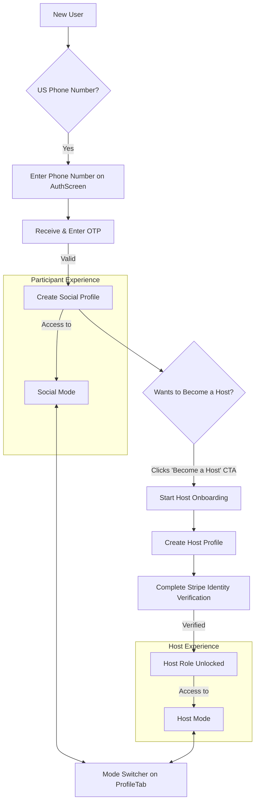

- **Story 001-02: Social Profile Creation**
  - **Goal**: Allow new users to create a basic social profile with their name and a profile photo immediately after successful authentication.

### From `_epics/01-foundational-user-host-lifecycle/prd.md`

**Functional Requirements:**

- Post-authentication flow to create a `socialProfile` with a name and profile photo.

**Foundational User & Host Flow**



**`users` Collection (Partial Schema from PRD)**

```typescript
// From convex/schema.ts

// ...
  users: defineTable({
    phone_number: v.optional(v.string()),
    is_verified: v.boolean(), // Becomes true after Stripe Identity check
    status: v.string(), // 'active', 'suspended', 'verification_pending', etc.
    active_role: v.string(), // 'social' or 'host', controlled by ModeSwitcher
    payment_customer_id: v.optional(v.string()), // Stripe Customer ID

    socialProfile: v.optional(v.object({
      first_name: v.string(),
      // ... other social fields
      photos: v.array(v.object({
        url: v.string(),
        is_authentic: v.boolean(),
        // ...
      })),
      // ...
    })),

    hostProfile: v.optional(v.object({
      host_type: v.string(), // 'user' or 'community'
      host_name: v.string(),
      host_bio: v.string(),
      // ... other host fields
    })),
  }).index("by_phone_number", ["phone_number"]),
// ...
```

### From `_docs/FEATURES.md`

**1. User Profiles & Verification**

User profiles will contain three categories of information:

- **Public Information**: Profile images, first name, etc.
- **Private Information**: Phone number for authentication and SMS notifications, an optional email for account recovery, etc. All private information is visible only to the user.
- **Internal Information**: Data used by the app for ranking and matching purposes, not visible to the user.
- **Identity & Preferences**: To facilitate our unique matching, users provide:
  - **`gender`**: A single selection from a comprehensive list (e.g., Woman, Man, Non-binary, Transgender Woman, etc.).
  - **`interested_in`**: A multiple-selection field indicating the genders they are interested in connecting with.
  - **`pronouns`**: An optional field that, if filled out, is displayed on their public profile.

**The Authentic Photo**

To build a foundation of trust and authenticity, Momento will include a feature to verify that a user's photo is recent and genuine.

- **In-App Camera:** Users will be prompted to take a photo of themselves from within the Momento app, using the native camera functionality.
- **"Authentic" Badge:** A photo taken this way receives a special "Authentic" badge, which is displayed on the user's profile and on their Face Card in the Memory Book.
- **12-Month Expiry:** To ensure photos remain current, the "Authentic" status and badge for a photo will automatically expire after 12 months. The user will then be prompted to take a new one.

### From `_docs/DATA_MODELS.md`

**`users` Collection**

Serves as the aggregate root for a user, combining private data (phone, email), public profiles (`socialProfile`, `hostProfile`), system settings, and internal metrics into a single document. This model optimizes for fetching all user-related information in a single read and determines a user's role (`Participant`, `Host`, or `Hybrid`) based on the presence of embedded profile objects.

| Field Name      | Type                            | Description                                                                                 |
| --------------- | ------------------------------- | ------------------------------------------------------------------------------------------- |
| `_id`           | `Id<"users">`                   | Convex system field. Primary Key.                                                           |
| `clerkId`       | `v.string()`                    | The user's unique ID from Clerk. This links the Convex user to the Clerk user. Indexed.     |
| `socialProfile` | `v.optional(v.object({ ... }))` | Embedded object containing the user's public-facing participant profile. See details below. |
| `...`           | `...`                           | Other fields omitted for brevity.                                                           |

**Embedded `socialProfile` Object**

| Field Name          | Type                         | Description                                                  |
| ------------------- | ---------------------------- | ------------------------------------------------------------ |
| `first_name`        | `v.string()`                 | User's public first name.                                    |
| `preferred_name`    | `v.optional(v.string())`     | The name the user prefers to be called.                      |
| `bio`               | `v.optional(v.string())`     | A short public biography.                                    |
| `photos`            | `v.array(v.object({ ... }))` | An embedded array of profile photo objects.                  |
| `current_photo_url` | `v.string()`                 | Denormalized URL of the main profile photo for quick access. |
| `...`               | `...`                        | Other fields omitted for brevity.                            |

**Embedded `socialProfile.photos` Array of Objects**

| Field Name             | Type                     | Description                                                                  |
| ---------------------- | ------------------------ | ---------------------------------------------------------------------------- |
| `url`                  | `v.string()`             | URL of the photo.                                                            |
| `is_authentic`         | `v.boolean()`            | True if the photo was taken through the in-app camera.                       |
| `authentic_expires_at` | `v.optional(v.number())` | Timestamp for when the "Authentic" badge expires (12 months after creation). |
| `created_at`           | `v.number()`             | Timestamp of when the photo was uploaded.                                    |

### From `_docs/USER_FLOWS/01_new_user_onboarding.md`

**3. Account Creation (US-Based User)**:

- `->` **`SignUpScreen`**: The user is navigated to the sign-up screen.
  - User enters their US phone number.
  - User receives an SMS with a one-time password and enters it on the same screen.
  - This entire flow is powered by Clerk's `useSignUp` hook.
- Upon successful verification, the flow continues to the profile creation steps:
- **`ProfileSetupScreen`**: User provides their public `first_name` and a short `bio`.
- **`InitialPhotoScreen`**: User uploads or takes their first profile photo. The UI encourages using the in-app camera to earn the "Authentic" badge.
- **`InterestDiscoveryScreen`**: The user is presented with a swipeable deck of "Possibility Cards."

### From `_docs/SCREENS_AND_COMPONENTS.md`

**1. Onboarding & Authentication Flow**

This flow is now managed by Clerk, which handles user sessions and the complexities of OTP-based phone authentication. We will build custom UI that leverages Clerk's hooks (`useSignIn`, `useSignUp`) for a seamless native experience.

- **Post-Authentication Flow**: Once a user is authenticated via Clerk, they proceed to the in-app profile and interest setup.
  - **`ProfileSetupScreen`**: For entering initial public profile information (name, bio).
  - **`InitialPhotoScreen`**: For taking or uploading the first profile photo.
  - **`InterestDiscoveryScreen`**: The swipeable deck of "Possibility Cards" to establish the user's initial interest vectors.
