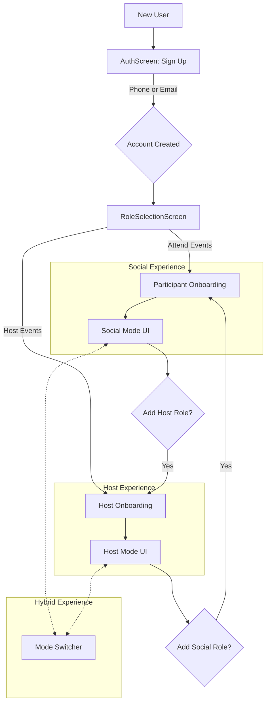

# 1. Title: PRD for Foundational User & Host Lifecycle

<version>1.1.0</version>

## Status: Draft

## Intro

This document outlines the Product Requirements for the **Foundational User & Host Lifecycle** epic. This is the first and most critical epic for Momento, establishing the core user-facing functionality that allows the platform to exist.

The primary goal is to build the essential pathways for a new user to join Momento by creating a core account and then choosing their initial journey: becoming a participant or becoming a host. This includes a unified authentication system (phone or email), an intent-driven onboarding flow, creation of social and host profiles, a mandatory safety verification gate for all hosts, and the UI mechanism for hybrid users to switch between their roles. Successfully implementing this epic will provide the foundational components upon which all other features will be built.

## Goals

- **Clear Project Objectives:**
  - Implement a secure, unified authentication system (phone/OTP or email/password).
  - Develop an intent-driven onboarding flow where users select their initial role (participant or host).
  - Establish the data models and UI flows for creating basic social and host profiles within their respective onboarding tracks.
  - Integrate a mandatory identity verification system for all hosts to ensure community safety.
  - Develop a seamless "mode-switching" experience for users who later adopt a second role.
- **Measurable Outcomes:**
  - A new user can successfully sign up with either a valid US phone number or an email/password.
  - After sign-up, a user is presented with a choice to onboard as a participant or a host.
  - The separate onboarding flows for participants and hosts are completed successfully.
  - A host can successfully complete identity verification via Stripe Identity.
  - A user with both profiles can switch between "Social Mode" and "Host Mode."
- **Success Criteria:**
  - The host verification gate must be 100% effective; no event can be published by an unverified host.
  - The user sign-up success rate should be above 95%.
  - The mode-switcher component correctly re-renders the app's navigation and context in 100% of cases.
- **Key Performance Indicators (KPIs):**
  - Number of new user sign-ups per week (segmented by phone vs. email).
  - Initial role selection ratio (Participant vs. Host).
  - Funnel completion rate for each onboarding track.
  - Conversion rate of host onboarding (from start to verification complete).

## Features and Requirements

- **Functional Requirements:**
  - Unified authentication allowing sign-up via phone number with OTP or email and password.
  - A mandatory `RoleSelectionScreen` presented to users immediately after their first sign-up.
  - A dedicated "Participant Onboarding" flow that includes creating a `socialProfile` and completing the `InterestDiscoveryScreen`.
  - A dedicated "Host Onboarding" flow that includes creating a `hostProfile`.
  - Integration with Stripe Identity for mandatory host verification.
  - A backend gate preventing unverified hosts from publishing events.
  - A `ModeSwitcher` UI component for users with both `socialProfile` and `hostProfile` to toggle the `users.active_role`.
- **Non-Functional Requirements:**
  - All user data, especially credentials and identity information, must be stored securely.
  - The authentication system must be scalable and reliable.
  - The Stripe Identity integration must handle various states, including success, failure, and pending.
- **User Experience Requirements:**
  - A smooth, low-friction sign-up experience for both phone and email users.
  - A clear and intuitive `RoleSelectionScreen` that helps users understand their choices.
  - A tailored, confidence-inspiring UI for both the participant and host onboarding flows.

## Epic List

This PRD concerns the primary epic. Future or related epics can be listed here for context.

- **This Epic**: `001: Foundational User & Host Lifecycle`
- **Future Epic**: `002: End-to-End Event Lifecycle (Host & Participant)`

---

## Story List for this Epic

This section breaks the epic into concrete, implementable stories. Completed stories are preserved to reflect work done, and new stories outline the remaining tasks to fulfill the epic's updated goals.

- **Story 01: Phone Authentication Setup (Completed)**
  - **Goal**: Implement US-only, phone-based authentication using One-Time Passwords (OTP) sent via SMS.
- **Story 02: Initial Social Profile Creation (Completed)**
  - **Goal**: Allow new users to create a basic social profile with their name and a profile photo immediately after successful phone authentication.
- **Story 03: Add Email Authentication (Completed)**
  - **Goal**: Enhance the existing authentication system to allow users to sign up and log in with an email and password, creating a unified auth experience.
- **Story 04: Implement Post-Signup Role Selection (Completed)**
  - **Goal**: Create the `RoleSelectionScreen` to be shown after sign-up. Reroute the completed social profile flow to become one of the branches selectable from this screen.
- **Story 05: Build Host Onboarding Flow**
  - **Goal**: Build the sequence of screens for the new host track, including host profile creation (`HostProfileSetupScreen`) and a prompt to begin identity verification.
- **Story 06: Host Verification with Stripe Identity**
  - **Goal**: Integrate Stripe Identity to verify hosts and enforce this check on the backend before an event can be published.
- **Story 07: Hybrid User Mode-Switching**
  - **Goal**: Implement a UI control and the corresponding backend logic for users who have both social and host roles to switch between the two contexts. This also includes the "add-a-role" flows for existing users.

## Strategic Context & Core Documents

To fully understand the scope and architectural impact of this epic, the following core project documents should be consulted. They can be found in the root `/_docs` directory.

- **Architecture:** `/_docs/ARCHITECTURE.md`
- **Development Process & Structure:** `/_docs/DEVELOPMENT_PROCESS.md`
- **User Flow(s):**
  - `/_docs/USER_FLOWS/01_new_user_onboarding.md` (Primary Flow)
  - `/_docs/USER_FLOWS/19_participant_becomes_host.md` (Secondary "Add-a-Role" Flow)
- **Feature Brief:** `/_docs/FEATURES.md` (Sections: "1. User Profiles & Verification" and "3. Hosting & Event Creation")
- **Data Models:** `/_docs/DATA_MODELS.md` (Collection: `users`)

## Technology Stack

| Technology          | Description                                                                 |
| ------------------- | --------------------------------------------------------------------------- |
| React Native (Expo) | Frontend framework for the cross-platform mobile app.                       |
| Convex              | Backend-as-a-service platform for data, auth, and serverless functions.     |
| Clerk               | Authentication provider for handling phone, email, and password auth.       |
| TypeScript          | Primary language for both frontend and backend for end-to-end type safety.  |
| Stripe Identity     | Third-party service for user identity verification, specifically for hosts. |

## Reference

### Foundational User & Host Flow



## Data Models, API Specs, Schemas, etc...

The core of this epic revolves around the `users` collection in Convex. The user's role (`Participant`, `Host`, or `Hybrid`) is determined by the presence of the `socialProfile` and `hostProfile` embedded objects.

### `users` Collection (Partial Schema)

```typescript
// From convex/schema.ts

// ...
  users: defineTable({
    // clerkId, phone_number, etc. from original schema
    email: v.optional(v.string()), // For email/password auth
    is_verified: v.boolean(), // Becomes true after Stripe Identity check
    status: v.union(
      v.literal("pending_onboarding"),
      v.literal("active"),
      v.literal("paused")
    ),
    active_role: v.optional(
      v.union(v.literal("social"), v.literal("host"))
    ), // controlled by ModeSwitcher

    socialProfile: v.optional(v.object({
      first_name: v.string(),
      // ... other social fields
      photos: v.array(v.object({
        url: v.string(),
        is_authentic: v.boolean(),
        // ...
      })),
      // ...
    })),

    hostProfile: v.optional(v.object({
      host_type: v.string(), // 'user' or 'community'
      host_name: v.string(),
      host_bio: v.string(),
      // ... other host fields
    })),
  }).index("by_phone_number", ["phone_number"]),
// ...
```

## Project Structure

This epic will touch the following key areas of the codebase:

```text
/
├── app/
│   ├── (auth)/           # Screens for unified sign-up and sign-in
│   ├── (onboarding)/     # New route group for onboarding flows
│   │   ├── role-selection.tsx
│   │   ├── participant/
│   │   └── host/
│   ├── (tabs)/           # Screens for Social/Host modes will live here
│   │   ├── _layout.tsx   # Logic to render correct layout based on active_role
│   │   └── ...
│   ├── modal.tsx         # Used for Stripe Identity flow
│   └── _layout.tsx       # Root layout, manages auth state
├── components/
│   └── ModeSwitcher.tsx  # The reusable mode-switching component
├── convex/
│   ├── clerk.ts          # Webhook for syncing Clerk user data
│   ├── users.ts          # Mutations/queries for creating/updating profiles
│   ├── schema.ts         # Definition of the `users` table and its indexes
└── _docs/
    └── ...               # All related documentation
```

## Change Log

| Change                            | Story ID | Description                                                                         |
| --------------------------------- | -------- | ----------------------------------------------------------------------------------- |
| Initial draft                     | N/A      | Initial draft PRD for the foundational user and host lifecycle.                     |
| Refactored for Intent-Driven Flow | 001-01   | Updated entire PRD to reflect new unified auth and role-selection based onboarding. |

```

```
