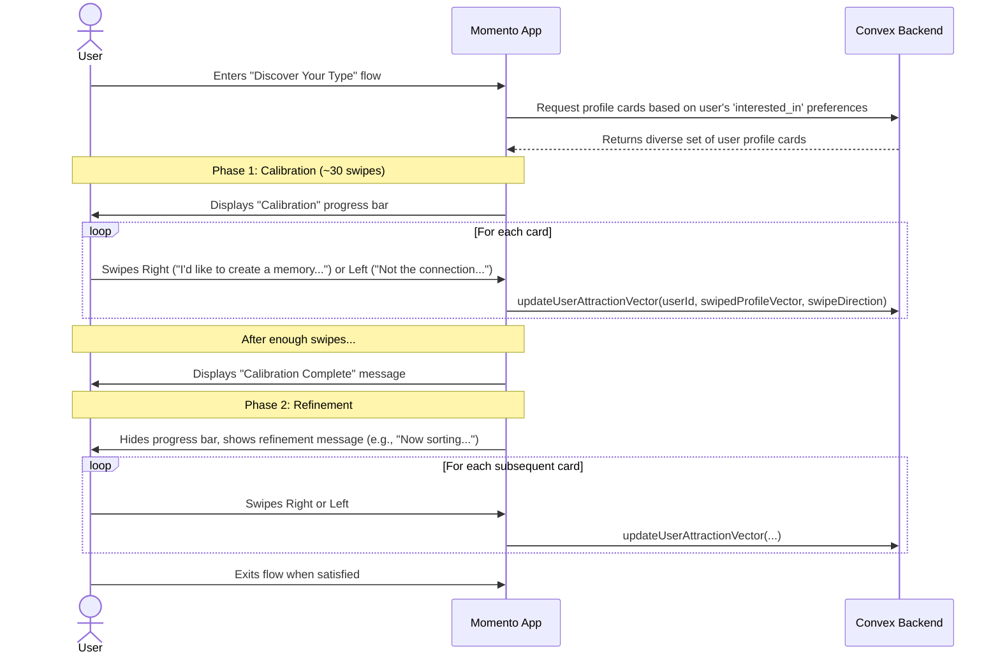

# 15. Discovering Your Type

This user flow details the "Discover Your Type" experience. It is a focused utility designed to build a nuanced, vector-based understanding of a user's preferences in other people for our matching algorithm.

- **Actors**: `New User` or `Existing User`.
- **Goal**: To build and refine the user's `person_attraction_vector` to improve person-to-person compatibility matching.

---

## The Flow

## Step-by-Step Description

1.  **Entry Point**: A user navigates to the `Discovery` tab and selects the "People" mode.
2.  **Phase 1: The Calibration Phase**:
    - The user is presented with a swipeable deck of profile cards. This feed is populated based on the user's `interested_in` preferences and is designed to be a focused utility, not an endless feed.
    - A `CalibrationProgressBar` is displayed with a message like, _"Help us calibrate your compass. The more you swipe, the better we can navigate to your type."_
    - For the first ~30 swipes, the profiles shown are deliberately diverse to establish a broad baseline of the user's preferences.
    - With each swipe, the app sends a signal to the backend. A right swipe (**"I'd like to create a memory with them"**) positively influences the user's `person_attraction_vector`. A left swipe (**"Not the connection I'm looking for"**) also provides valuable data to refine the vector. Swipes are private and do not send a "like" notification to the other user.
3.  **The Calibration Complete Moment**:
    - After the initial calibration is complete, the progress bar is replaced with a `CalibratedStateIndicator`.
    - The UI displays a clear message indicating completion and transparency: _"Thanks, your compass is calibrated! We're now sorting people we think you'll connect with to the top."_
4.  **Phase 2: The Refinement Phase**:
    - The profile deck is now strategically sorted. The majority of profiles shown are those the algorithm predicts the user will be interested in, with "serendipity" profiles included to avoid an echo chamber.
    - The user is informed that the core task is complete, but they can return at any time to further refine their preferences, which discourages endless swiping.
