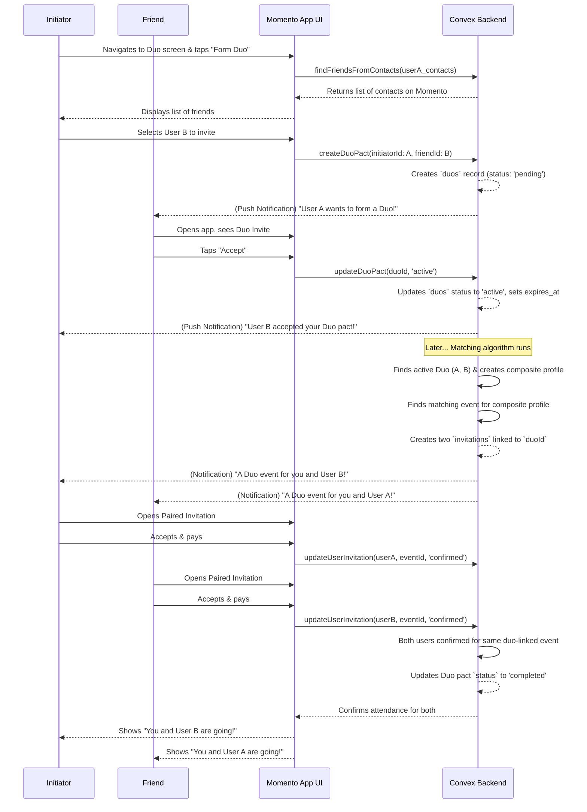

# 23. Dynamic Duos: End-to-End Flow

This document provides a complete, end-to-end overview of the "Dynamic Duos" feature, from two users forming a pact to them successfully attending an event together. This flow is a cornerstone of the Momento experience, designed to let friends attend events as a pre-declared pair.

- **See Also:**
  - **Features:** `_docs/FEATURES.md` (Section: [6. Dynamic Duos](#6-dynamic-duos-attend-with-a-friend))
  - **UI:** `_docs/SCREENS_AND_COMPONENTS.md` (Screens: `FormDuoScreen`, `InvitationDetailScreen`; Components: `DuoBadge`)
  - **Data Model:** `_docs/DATA_MODELS.md` (Collections: `duos`, `invitations`)
  - **Algorithm:** `_docs/MATCHING_ALGORITHM.md`

---

## 1. Actors

- `User A` (The Initiator)
- `User B` (The Friend/Recipient)
- `Backend Matching Algorithm`

## 2. Goal

- To provide a seamless experience for two friends to form a temporary "pact" to attend an event together.
- To have the matching algorithm intelligently find a suitable event for the pair.
- To have both users accept the same paired invitation, fulfilling the pact.

## 3. Preconditions

- Both User A and User B are existing Momento users.
- Both users have each other's phone number saved in their device's contacts list.

## 4. End-to-End User Flow Diagram (Mermaid)

## 5. Step-by-Step Breakdown

### Part 1: Forming the Pact

1.  **Initiation**: User A navigates to the "Dynamic Duos" section of the app (the `DuoHomeScreen`) and decides to form a new pact.
2.  **Friend Discovery**: The app requests one-time access to the phone's contacts, sending the contact list to the backend to find which friends are also on Momento.
3.  **Sending the Invite**: The app displays a list of User A's friends who are on Momento. User A selects User B and sends a Duo invitation. The backend creates a `duos` record with `status: 'pending'`.
4.  **Acceptance**: User B receives a notification, opens the app, and accepts the Duo invitation from their `DuoHomeScreen`.
5.  **Pact Activation**: The backend updates the `duos` record's `status` to `'active'` and sets an expiration date (e.g., two weeks). The pact is now active, and the matching algorithm will consider them a single entity.

### Part 2: The Paired Invitation

6.  **Matching Process**: At a later time, the backend's matching algorithm runs. It identifies the active Duo, creates a temporary "composite interest profile" for them (averaging their interests, using the more restrictive of their filters), and finds a suitable event with at least two spots.
7.  **Sending Invitations**: The backend creates two separate `invitations`, one for each user, but links both to the same `duoId`. It then sends a special "Paired Invitation" notification to both users simultaneously.

### Part 3: Responding & Fulfilling the Pact

8.  **Independent Responses**: Both users open the app to a special `InvitationDetailScreen` that clearly indicates it's a "Paired Invitation" for them and their friend. They can each accept or decline **independently**.
9.  **Pact Fulfillment Logic**: The Duo pact remains `active` until one of two things happens:
    - **Success**: Both users accept the invitation for the same event. Once the backend sees both `invitations` linked to the `duoId` are `confirmed`, it updates the `duos` pact status to `completed`. The pact is successfully fulfilled.
    - **Expiration**: The `expires_at` timestamp is reached. The pact becomes `expired`.
10. **Scenario: One Accepts, One Declines**: If User A accepts but User B declines, User A is still confirmed and can attend the event alone. The Duo pact, however, is not fulfilled and remains `active`. The system will continue to look for other events for the pair until the pact expires.
11. **Arrival Experience**: If both users attend the event, their `FaceCard`s in the "Deck of Cards" arrival UI will feature a `DuoBadge`, signaling to other attendees that they arrived as a pair.
