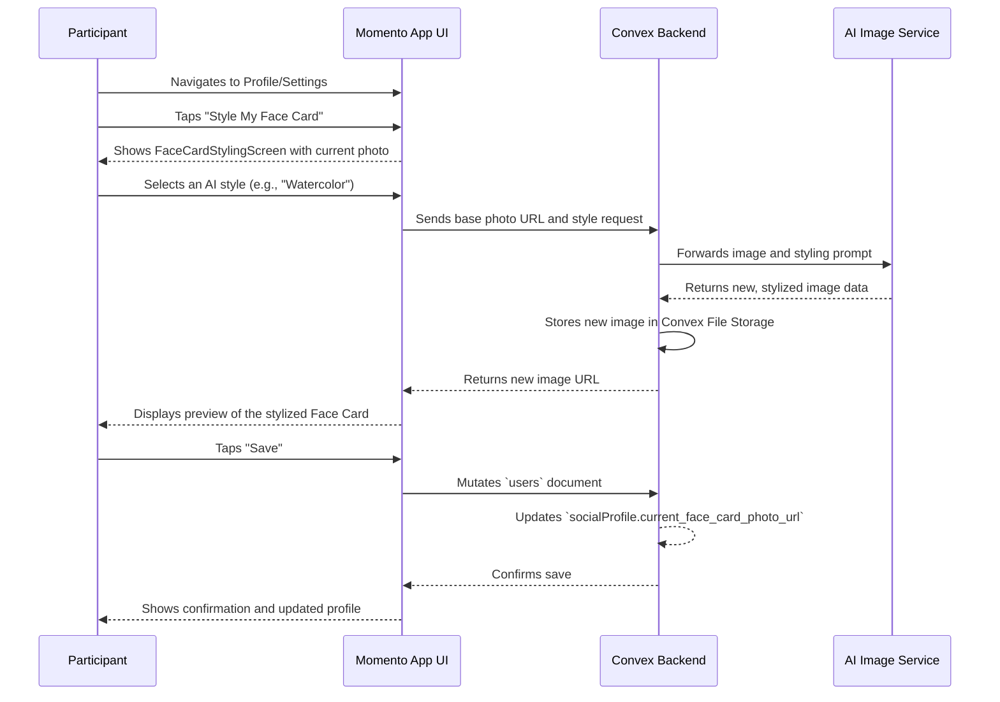

# 17. Customizing a Face Card

This document describes the user flow for applying AI-driven styles and other customizations to a "Face Card," which is the user's primary photo representation in other people's `MemoryBook`.

- **See Also:**
  - **Features:** `_docs/FEATURES.md` (Section: [10. The Memory Book & The Face Card](#10-the-memory-book--the-face-card))
  - **UI:** `_docs/SCREENS_AND_COMPONENTS.md` (Screens: `FaceCardStylingScreen`, `ProfileTab`, `SettingsScreen`)
  - **Data Model:** `_docs/DATA_MODELS.md` (Collections: `users` (specifically the `socialProfile.current_face_card_photo_url` and `socialProfile.photos` fields))

---

## 1. Actor

- **Participant**: An authenticated user with an active `socialProfile`.

## 2. Goal

- To allow a user to personalize their appearance in the Momento ecosystem by applying unique, AI-driven visual styles and other cosmetic upgrades to their Face Card photo.
- To provide a moment of delight and self-expression that enhances the collectible nature of Face Cards.

## 3. Preconditions

- The user has an active account with a `socialProfile`.
- The user has at least one photo uploaded to their profile, which serves as the base image for styling.

## 4. User Flow Diagram (Mermaid)

## 5. Step-by-Step Breakdown

1.  **Accessing the Styling Screen**:
    - The user can initiate this flow from two primary locations:
      - Their main `ProfileTab`.
      - The `SettingsScreen`, under the "Participant" or "Social Profile" tab.
    - They tap an option labeled **"Style My Face Card"** (or similar), which navigates them to the `FaceCardStylingScreen`.

2.  **Selecting a Style**:
    - The `FaceCardStylingScreen` displays a large preview of their current, unstyled Face Card photo.
    - Below the preview, a list or carousel shows the available customization options. These could include:
      - **AI Styles**: "Watercolor," "Oil Painting," "Pencil Sketch," "Retro Film," etc.
      - **Borders/Frames**: Decorative frames unlocked through achievements (e.g., "5-Event Veteran," "First Host").
    - The user taps on a style to select it.

3.  **Generating the Preview**:
    - When an AI style is selected, the app shows a loading indicator while it processes the image.
    - The backend sends the user's base photo and the chosen style parameter to an external **AI Image Service**.
    - The service returns the newly generated image.
    - The backend stores this new image in **Convex File Storage** and returns the new URL to the client.
    - The `FaceCardStylingScreen` updates the preview to show the newly stylized image.

4.  **Saving the Change**:
    - If the user is happy with the preview, they tap a **"Save"** or **"Apply"** button.
    - The client calls a Convex mutation to update the current user's document.
    - The mutation updates the `socialProfile.current_face_card_photo_url` field to the URL of the newly generated and stored image.
    - The user is navigated back to their profile, where they see their updated Face Card.

## 6. Important Architectural Notes

- **Immutability of Memories**: The change to a user's Face Card is **not retroactive**. When a Face Card is collected and added to another user's `MemoryBook`, it is stored as an immutable `snapshot_face_card_url` in the `connections` document. This preserves the memory of how that person looked _at that time_.
- **New Connections**: Any _new_ connections made after the user updates their Face Card will see the new, stylized version. This makes Face Cards feel like living, evolving mementos.
- **Unlocking Styles**: The availability of certain styles or frames can be tied to a user's `internalMetrics` or achievements, creating a gamified incentive for active and positive participation in the community.

## 7. Postconditions

- **Success**:
  - The user's `socialProfile.current_face_card_photo_url` is updated with the URL of the new, stylized image.
  - The user's public-facing profile now displays the new Face Card style.
- **Failure**:
  - The AI image service fails to generate an image. The UI should display a user-friendly error message and allow the user to try again.
  - A network error prevents the final save. The UI should show an error and allow the user to retry the save without having to re-generate the image.
