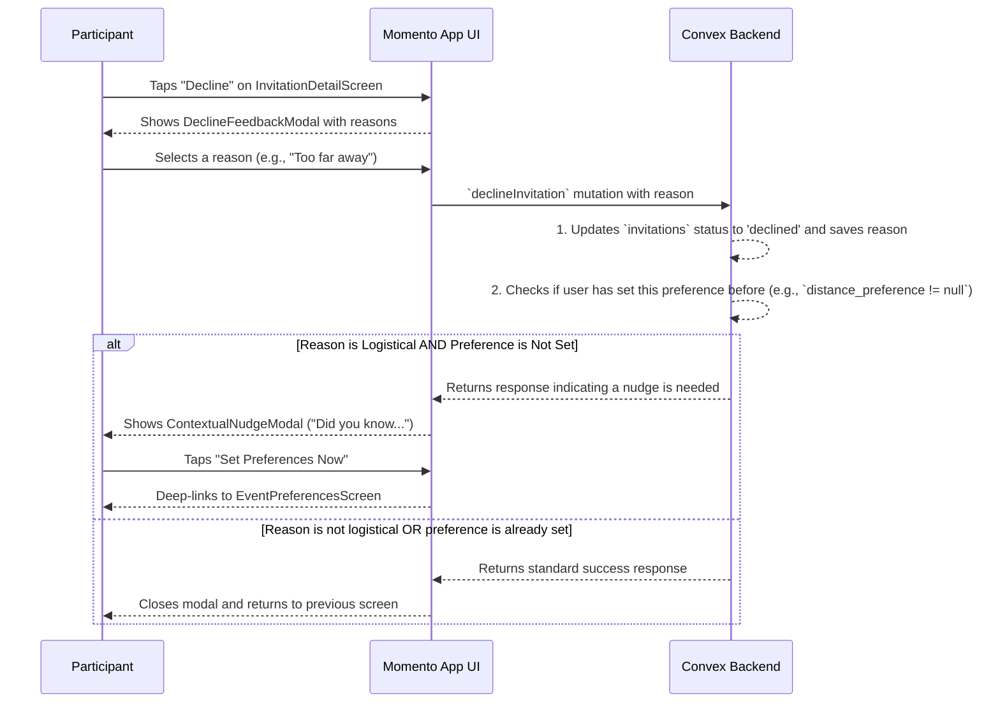

# 22. User Declines Invite (Contextual Onboarding)

This document outlines the user flow that occurs when a participant declines an event invitation. The flow is designed not only to capture valuable feedback for the matching algorithm but also to act as a "contextual onboarding" moment, teaching users about preference filters when they are most relevant.

- **See Also:**
  - **Features:** `_docs/FEATURES.md` (Section: [5. Declining an Invitation](#declining-an-invitation-capturing-user-intent))
  - **UI:** `_docs/SCREENS_AND_COMPONENTS.md` (Modals: `DeclineFeedbackModal`, `ContextualNudgeModal`)
  - **Data Model:** `_docs/DATA_MODELS.md` (Collections: `invitations`, `users`)
  - **Algorithm:** `_docs/MATCHING_ALGORITHM.md`

---

## 1. Actor

- **Participant**: An authenticated user who has received an event invitation.

## 2. Goal

- To understand _why_ a user is declining an event to provide a powerful feedback signal to the matching algorithm.
- To seize the moment of logistical friction (e.g., "Too far away") to teach the user about preference-setting features they may not know exist, thereby improving their future experience.

## 3. Preconditions

- The user has an active invitation (`status: 'sent'`) and is viewing it on the `InvitationDetailScreen`.

## 4. User Flow Diagram (Mermaid)

## 5. Step-by-Step Breakdown

1.  **Initiating Decline**:
    - On the `InvitationDetailScreen`, the user taps the **"Decline"** button.

2.  **Providing Feedback**:
    - This action immediately presents the `DeclineFeedbackModal`.
    - The modal asks for a reason, presenting a list of options:
      - "I'm busy that day"
      - "This event isn't for me"
      - "I'm looking to try new things"
      - **"Too far away"**
      - **"Too expensive"**
      - "The vibe doesn't feel right"
    - The user selects one reason.

3.  **Backend Processing & Decision**:
    - The client calls a `declineInvitation` mutation, passing the `invitationId` and the chosen `reason`.
    - The backend first updates the `invitations` document, setting its `status` to `'declined'` and storing the `decline_reason`.
    - **Crucially, the backend then checks for the "nudge" condition:**
      - **IF** `reason` is "Too far away" **AND** the `users.distance_preference` field is `null`.
      - **OR IF** `reason` is "Too expensive" **AND** the `users.price_sensitivity` field is `null`.
      - **THEN** the backend's response to the client includes a flag to trigger the contextual nudge.
      - Otherwise, it returns a standard success response.

4.  **The Contextual Nudge**:
    - If the nudge condition is met, the UI dismisses the `DeclineFeedbackModal` and immediately presents the `ContextualNudgeModal`.
    - The modal's content is specific to the reason given:
      - _(For "Too far away")_: **"Tired of the commute?** You can set a max travel distance to get invitations closer to home."
      - _(For "Too expensive")_: **"Want to stick to a budget?** You can set a price comfort level to get invitations that match."
    - The modal has two buttons:
      - **"Set Preferences Now"**: Tapping this deep-links the user directly to the `EventPreferencesScreen`, where they can immediately set the relevant filter.
      - **"Maybe Later"**: This dismisses the modal. The system should ideally track that this specific nudge has been shown to avoid repeatedly bothering the user.

5.  **Standard Decline (No Nudge)**:
    - If the user selects a non-logistical reason (e.g., "This event isn't for me"), or if they have already set the relevant preference, the `DeclineFeedbackModal` simply closes after their selection, and the flow ends.

## 6. Postconditions

- **Success (Standard Decline)**:
  - The `invitations` document is updated to `status: 'declined'` with the reason.
  - The algorithm now has a new signal to use for refining future matches.
- **Success (Contextual Onboarding)**:
  - All of the above, plus:
  - The user has been educated about a key feature at the exact moment it was most relevant to them.
  - The user may have been successfully deep-linked to the settings screen to improve their future experience.
