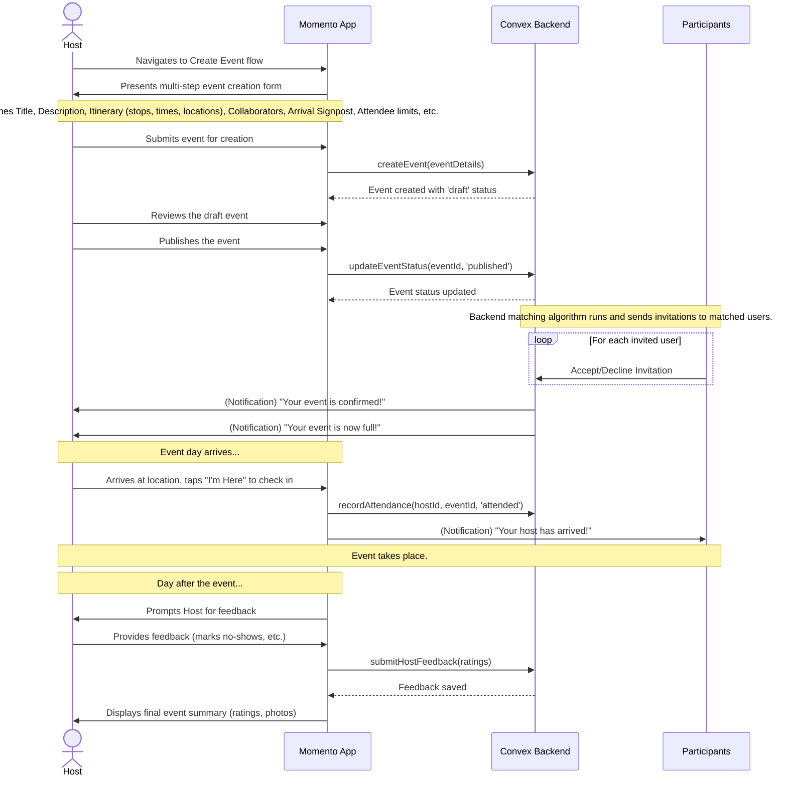

# 11. Event Lifecycle (Host's View)

This user flow documents the complete journey for a host, from creating a new event to managing it and reviewing its success. This is the primary workflow for `User Host` and `Community Host` personas.

- **Actor**: A `Host` (e.g., "David, the Curator").
- **Goal**: To create a compelling event, have it successfully attended by a well-matched group, and receive positive feedback.

---

## The Flow

## Step-by-Step Description

1.  **Initiation**: The Host decides to create a new event. They navigate to their "Host Mode" dashboard and initiate the `CreateEventFlow`.
2.  **Event Definition**: The Host proceeds through a guided, multi-step form to define all aspects of the event:
    - Core details: `title`, `description`.
    - Itinerary: Adds one or more `Itinerary Stops`, each with a location, start/end times, and description.
    - Logistics: Sets `min_attendees`, `max_attendees`, and any age restrictions.
    - The Arrival: Defines the crucial `arrival_signpost` to help attendees find the group.
    - Collaborators: Adds any co-hosts or instructors.
3.  **Draft & Publish**: After filling out the details, the event is saved as a `draft`. The Host can review everything and, when ready, taps "Publish." This moves the event to the "Upcoming" section of their `EventsTab`.
4.  **Matching & Invitations**: The app backend updates the event's status to `published`. The matching algorithm then identifies and sends invitations to the best-matched participants.
5.  **Monitoring**: The Host can monitor the status of their upcoming event from the `EventsTab`. They receive notifications as the event fills up, such as when the minimum number of attendees is met ("Your event is on!") and when it's full.
6.  **Event Day**: On the day of the event, the Host arrives at the first location and checks in via the app, which reveals the "Deck of Cards" UI for them and any already-arrived attendees. Their check-in can also trigger a notification to participants.
7.  **Post-Event Feedback**: The day after the event, the Host is prompted to provide feedback. This is primarily to report any "no-shows" or "check-in & bail" attendees, which is critical data for the platform's community health metrics.
8.  **Review**: Once feedback is submitted, the event moves to the "Past" section of the `EventsTab`. Here, the Host can view the event's final summary, including the average rating it received from attendees and any photos shared in the event gallery.
