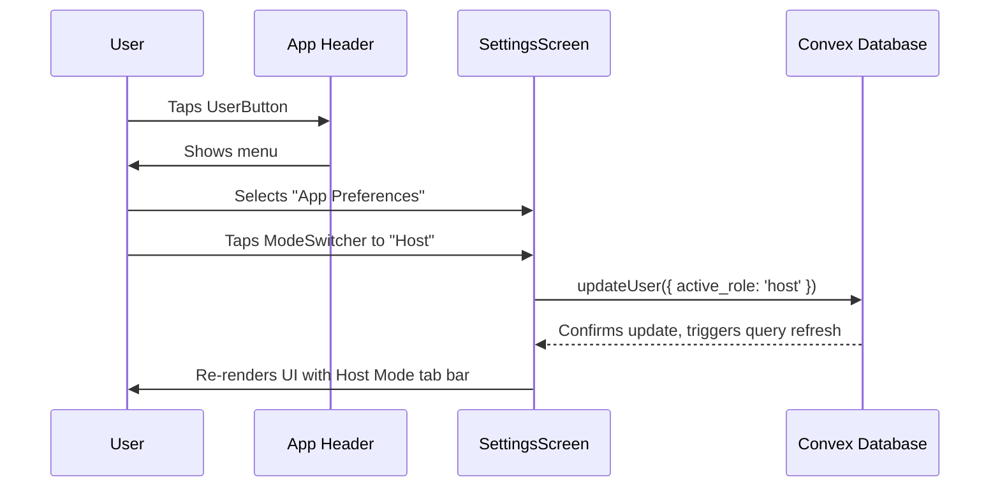

# 20: Switching Between Social & Host Modes

This user flow describes how a `Hybrid User` (an individual who is both a `Participant` and a `Host`) switches between the app's two primary interfaces: "Social Mode" and "Host Mode." This functionality is key to providing a focused, uncluttered experience.

- **Actor**: A `Hybrid User` (e.g., "David, the Curator").
- **Goal**: To switch from the social-focused experience to the host management dashboard, and back again.

---

### Pre-Conditions

- The user is a `Hybrid User` and is currently in `Social Mode`.
- The user wants to manage their hosting duties.

### The Flow

1.  **Trigger**: The user taps the `<UserButton>` in the main app header.
2.  **Action**: From the menu that appears, the user selects "App Preferences".
3.  **Navigation**: The user is navigated to the custom `SettingsScreen`.
4.  **Action**: At the top of the `SettingsScreen`, the user taps the `ModeSwitcher` control, changing it from "Social" to "Host".
5.  **System Action**: The app triggers a Convex mutation to update the `users.active_role` field in the database from `'social'` to `'host'`.
6.  **System Action**: The root navigation component, listening to this data change, re-renders the app's main navigation structure.

### Post-Conditions

- The `Social Mode Navigation` (the default tab bar) is replaced by the `Host Mode Navigation` tab bar.
- The user now sees the Host Dashboard, Events Management, and Host Inbox tabs, and is ready to perform hosting-related tasks.

### Diagram

