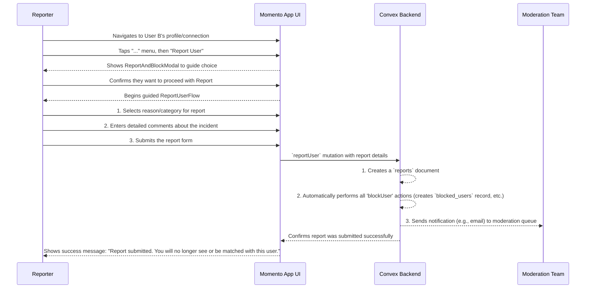

# 25. User Safety: Reporting Another User

This document outlines the user flow for the "Report" feature. This is a formal escalation process for when a user's behavior violates community guidelines and requires review by the Momento team. This action is more severe than a "Block."

- **See Also:**
  - **Features:** `_docs/FEATURES.md` (Sections: [12. A Three-Tiered System](#a-three-tiered-system), [Reporting & Consequence Framework](#reporting--consequence-framework))
  - **UI:** `_docs/SCREENS_AND_COMPONENTS.md` (Flows: `ReportUserFlow`; Modals: `ReportAndBlockModal`)
  - **Data Model:** `_docs/DATA_MODELS.md` (Collections: `reports`, `blocked_users`)

---

## 1. Actors

- **User A (The Reporter)**: Any authenticated user.
- **User B (The Reported)**: The user whose behavior is being reported.
- **Momento Moderation Team**: The internal team that reviews and acts on reports.

## 2. Goal

- To provide a clear, structured process for users to report community violations.
- To ensure the reporter feels heard and protected by immediately and automatically blocking the reported user.
- To provide the moderation team with the necessary information to investigate and take appropriate action.

## 3. Preconditions

- User A has encountered User B and believes their behavior warrants a formal report.

## 4. User Flow Diagram (Mermaid)

## 5. Step-by-Step Breakdown

1.  **Initiating the Report**:
    - User A navigates to User B's profile, their entry in the `MemoryBook`, or a message thread.
    - They tap the "..." menu and select the "Report" option.

2.  **Guided Choice (Optional but Recommended)**:
    - To prevent misuse, the `ReportAndBlockModal` may appear first.
    - It educates the user, explaining that "Block" is for personal preference, while "Report" is for actual violations of community standards (e.g., harassment, safety concerns, misrepresentation).
    - User A confirms they need to file a formal report.

3.  **The Guided Report Flow (`ReportUserFlow`)**:
    - The user is taken into a dedicated, multi-step reporting flow.
    - **Step 1: Categorize**: The user must select a category for the violation from a predefined list (e.g., "In-Person Misconduct," "Inappropriate Photos," "Spam or Scam," "Hate Speech").
    - **Step 2: Describe**: The user is required to provide details in a text area. The prompt encourages them to be specific: "Please describe what happened, including where and when."
    - **Step 3: Submit**: The user reviews their report and submits it. The UI clearly states that submitting the report will also automatically block the user.

4.  **Backend Action**:
    - The client calls a `reportUser` Convex mutation with all the report details.
    - The backend executes a transaction with two primary objectives:
      1.  **Create Report Record**: A new document is created in the `reports` collection, containing the `reporterId`, `reportedId`, `reason`, `comments`, and `eventId` if the incident occurred at an event.
      2.  **Execute Block**: The system automatically performs all the actions associated with blocking a user (creates a `blocked_users` record, deletes `connections`, disables `conversations`). This is a critical and immediate safety measure.
      3.  **Notify Moderators**: The backend sends an alert (e.g., a webhook or a transactional email via Postmark) to the internal moderation team's queue, containing all the details of the new report.

5.  **Confirmation and Closure**:
    - The UI confirms to User A that their report has been submitted and that User B has been blocked.
    - The flow concludes. At a later date, User A may receive a follow-up notification regarding the outcome of their report (e.g., "An update on your recent report: We have reviewed the case and taken appropriate action according to our community guidelines.").

## 6. Postconditions

- **Success**:
  - A `reports` document is created for the moderation team to review.
  - A `blocked_users` record is created, and the reporter is immediately protected from any further contact with the reported user.
  - The reporter receives clear confirmation that their voice has been heard.
- **Consequences for Reported User**:
  - Depending on the severity and validity of the report, the reported user may face consequences ranging from a warning to account suspension or a permanent ban, as outlined in the "Reporting & Consequence Framework."
