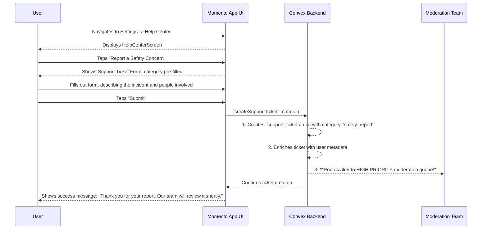

# 26. User Safety: Reporting via Help Center

This document outlines the user flow for reporting a safety or trust concern through the app's general Help Center. This serves as a vital "catch-all" mechanism for incidents that may not be tied to a specific user's profile at the moment of reporting (e.g., a concern about an event's location, or an incident where the user can't find the other person's profile).

- **See Also:**
  - **UI:** `_docs/SCREENS_AND_COMPONENTS.md` (Screens: `HelpCenterScreen`)
  - **Data Model:** `_docs/DATA_MODELS.md` (Collections: `support_tickets`)
  - **Related Flow:** `_docs/USER_FLOWS/20_contacting_support.md`

---

## 1. Actor

- **User**: Any authenticated Momento user.

## 2. Goal

- To provide a clear and accessible channel for reporting safety issues that don't fit the direct user-to-user reporting flow.
- To ensure these sensitive reports are triaged and routed to the correct moderation team with high priority.

## 3. Preconditions

- The user is logged in and can access the `SettingsScreen`.

## 4. User Flow Diagram (Mermaid)

## 5. Step-by-Step Breakdown

1.  **Accessing the Form**:

    - The user navigates to `SettingsScreen` -> `HelpCenterScreen`.
    - Alongside the general "Contact Support" option, there is a distinct and clearly labeled button: **"Report a Safety Concern"**.

2.  **Submitting a Safety Report**:

    - Tapping this button opens the familiar support ticket form, but with a key difference: the `category` field is pre-selected and locked to **"Safety & Trust Report"**.
    - The form prompts the user to be as detailed as possible in the `body` text area, encouraging them to include:
      - The name(s) of the user(s) involved.
      - The name and date of the event where the incident occurred.
      - A specific description of the behavior or concern.
    - The user fills out the form and taps "Submit".

3.  **Backend Processing & High-Priority Routing**:

    - The client calls the same `createSupportTicket` Convex mutation as the general support flow.
    - The backend creates a new `support_tickets` document.
    - **Crucially**, the backend's notification logic inspects the ticket's `category`.
    - Because the category is `'safety_report'`, it bypasses the general support queue. Instead, it triggers a high-priority alert (e.g., a tagged email to `trust@momento.app` or a PagerDuty/Slack alert) that goes directly to the **Moderation Team**.

4.  **Confirmation**:
    - The user receives an in-app confirmation that their report has been received and is being reviewed with priority.
    - They may also receive a separate, automated email confirming receipt and explaining the review process for sensitive reports.

## 6. Postconditions

- **Success**:
  - A `support_tickets` document is created with the `safety_report` category.
  - The Moderation Team is immediately notified of a high-priority issue.
  - The user is assured their concern is being taken seriously.
- **Note**: This flow does **not** automatically block a user, because the report may not be about a specific, identifiable user in the system. The moderation team is responsible for investigating the details provided and taking subsequent actions, which may include blocking users, removing content, or contacting the reporter for more information.
