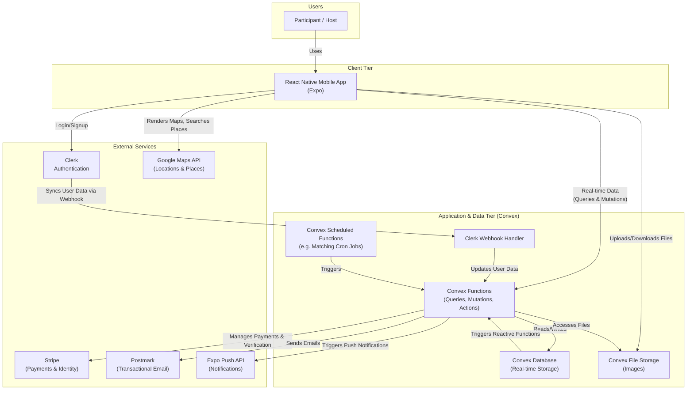

# High Level Architecture

## Technical Summary

Momento's architecture is a modern, serverless, real-time system designed for a cross-platform mobile experience. The frontend is a React Native application managed with Expo, featuring a dynamic, role-based UI built with Expo Router and NativeWind. The backend is powered by Convex, providing a unified database, serverless functions, and file storage with real-time data synchronization. Key integrations include Clerk for authentication (synchronized via webhooks) and Stripe for payments and identity verification. This tightly integrated fullstack approach enables the rapid development of core features like concept-based matching, real-time event updates, and post-event social features, directly supporting the project's mission to foster genuine connections.

## Platform and Infrastructure Choice

The project is built on a serverless, "backend-as-a-service" (BaaS) model, with **Convex** serving as the primary backend platform. The mobile application is built and deployed via **Expo Application Services (EAS)**.

- **Platform:** Convex
- **Key Services:**
  - **Compute & Database:** Convex (Serverless Functions, Real-time Database, File Storage)
  - **Authentication:** Clerk (Handles user lifecycle and syncs data to Convex via webhooks)
  - **Payments & Identity:** Stripe
  - **Push Notifications:** Expo Push Notifications (via EAS)
  - **Mapping & Geolocation:** Google Maps Platform
  - **Transactional Email:** Postmark
  - **Build & Distribution:** Expo Application Services (EAS) for Apple App Store and Google Play Store.
- **Deployment Host and Regions:**
  - **Backend (Convex):** Hosted and managed by Convex (typically in `us-west`).
  - **Mobile App:** Distributed globally via the Apple App Store and Google Play Store.

## Repository Structure

- **Structure:** The project utilizes a **Monorepo** structure, co-locating the frontend mobile application and the backend Convex code within a single Git repository.
- **Monorepo Tool:** No formal monorepo management tool (like Turborepo or Nx) is currently in use. The structure is managed by convention.
- **Package Organization:**
  - `app/`: Contains all frontend screens, layouts, and routing logic (Expo Router).
  - `components/`: A library of reusable, shared React Native components.
  - `convex/`: Houses all backend code, including the database schema, serverless functions, and auth configuration.
  - `hooks/`: Custom React hooks used by the frontend.

## High Level Architecture Diagram

## Architectural Patterns

- **Serverless Architecture:** The entire backend is built on Convex, eliminating the need for server management and reducing operational overhead.
- **Role-Based UI Architecture:** The frontend dynamically adapts its navigation and features based on the user's `active_role` ('social' or 'host'), providing a focused, uncluttered experience for each user type.
- **Document-Oriented Data Modeling:** Data is structured in rich, nested documents to optimize for read performance by reducing the number of queries needed to fetch related data.
- **Real-time Data Sync:** The application leverages Convex's real-time capabilities to instantly push database updates to the client, creating a dynamic and responsive user experience.
- **Component-Based UI:** The frontend is constructed from a library of reusable, domain-specific components, promoting code reuse and consistency.
- **Event-Driven Integration (Webhooks):** Critical services like Clerk are integrated via webhooks, which trigger Convex actions to synchronize data asynchronously, decoupling services.
