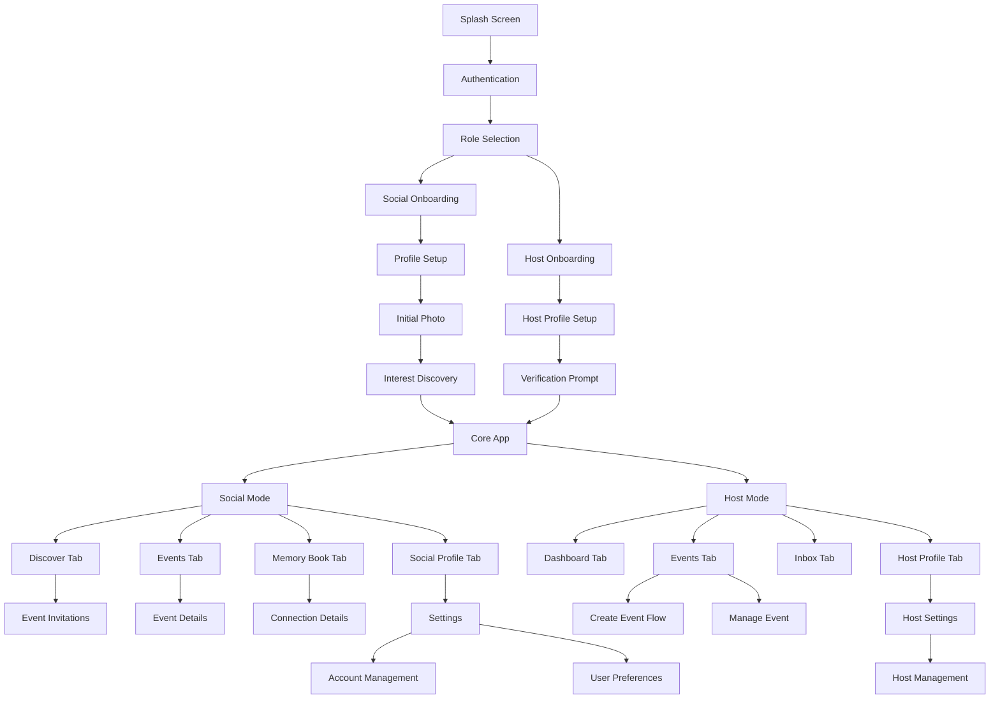
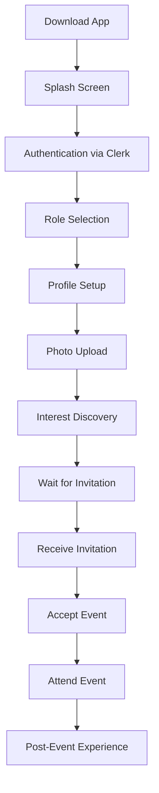
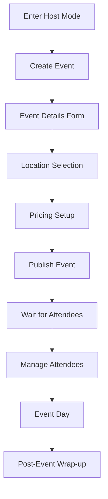
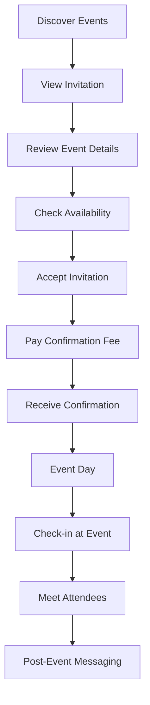

# Momento UI/UX Specification

## Introduction

This document defines the user experience goals, information architecture, user flows, and visual design specifications for Momento's user interface. It serves as the foundation for visual design and frontend development, ensuring a cohesive and user-centered experience that embodies the "esoteric-tarot meets Art Deco" aesthetic while maintaining functionality and accessibility.

### Overall UX Goals & Principles

#### Target User Personas

**Social Participants (Primary):**

- Young professionals (25-35) seeking meaningful social connections
- Value quality experiences over quantity of interactions
- Appreciate curated, premium-feeling experiences
- Want to discover new interests and meet like-minded people

**Event Hosts (Secondary):**

- Creative professionals and entrepreneurs hosting unique experiences
- Need efficient tools to manage events and attendees
- Value trust and verification systems
- Want to build community around their events

**Hybrid Users (Advanced):**

- Users who both attend and host events
- Need seamless mode-switching between participant and host contexts
- Value comprehensive profile management
- Appreciate advanced features like Dynamic Duos

#### Usability Goals

- **Ease of learning:** New users can complete onboarding and attend their first event within 10 minutes
- **Efficiency of use:** Power users can navigate between modes and manage events with minimal friction
- **Error prevention:** Clear validation and confirmation for destructive actions like event cancellation
- **Memorability:** Infrequent users can return without relearning core navigation patterns
- **Delight:** Every interaction feels like an adventure, not a survey

#### Design Principles

1. **"This is an Adventure, Not a Survey"** - Every interaction should feel exciting and meaningful
2. **Quality Over Quantity** - Immediate communication of premium, curated experiences
3. **Progressive Disclosure** - Show only what's needed, when it's needed
4. **Consistent Patterns** - Use familiar UI patterns throughout the application
5. **Accessible by Default** - Design for all users from the start, WCAG AA compliance

### Change Log

| Date       | Version | Description                     | Author    |
| ---------- | ------- | ------------------------------- | --------- |
| 2024-12-19 | 1.0     | Initial front-end specification | UX Expert |

## Information Architecture (IA)

### Site Map / Screen Inventory

### Navigation Structure

**Primary Navigation:** Tab-based navigation with context-aware switching between Social and Host modes using the ModeSwitcher component.

**Secondary Navigation:** Modal-based flows for specific tasks (event creation, profile editing, settings).

**Breadcrumb Strategy:** Minimal breadcrumbs for deep flows, with clear back navigation and contextual headers.

## User Flows

### User Flow: New User Onboarding

**User Goal:** Complete initial setup and attend first event

**Entry Points:** App store download, referral link, social media

**Success Criteria:** User has completed profile setup, discovered interests, and received first event invitation

#### Flow Diagram

#### Edge Cases & Error Handling:

- Authentication failure → Clear error message with retry options
- Photo upload failure → Fallback to default avatar with retry
- No events available → Empty state with clear next steps
- Network connectivity issues → Offline mode with sync when available

**Notes:** This flow emphasizes the "adventure" feeling through the Interest Discovery phase, which uses swipeable "Possibility Cards" rather than traditional forms.

### User Flow: Event Hosting

**User Goal:** Create and manage a successful event

**Entry Points:** Host mode activation, "Become a Host" CTA

**Success Criteria:** Event is published, attendees are confirmed, and event runs successfully

#### Flow Diagram

#### Edge Cases & Error Handling:

- Verification required → Clear prompt with Stripe Identity integration
- Location not found → Manual address entry with validation
- Pricing errors → Clear breakdown of fees and costs
- Low attendance → Options to extend or cancel with refunds

**Notes:** Hosts must complete identity verification before publishing events, ensuring trust and safety.

### User Flow: Event Participation

**User Goal:** Discover, join, and enjoy events with new connections

**Entry Points:** Discover tab, event invitations, notifications

**Success Criteria:** User attends event, meets new people, and builds connections

#### Flow Diagram

#### Edge Cases & Error Handling:

- Event full → Waitlist option with clear position
- Payment failure → Retry with alternative payment methods
- Event cancellation → Automatic refund and notification
- No-show → Rating impact and fee retention

**Notes:** The "Deck of Cards" UI for attendee check-in creates a memorable, game-like experience.

## Wireframes & Mockups

**Primary Design Files:** Figma design system and component library (to be created)

### Key Screen Layouts

#### Discover Tab

**Purpose:** Main discovery hub for event invitations and content

**Key Elements:**

- Swipeable invitation cards with gold borders
- Match reason banners explaining why user was invited
- Filter controls for preferences (distance, price, timing)
- Empty states with engaging illustrations

**Interaction Notes:** Cards use subtle animations and gold foil-stamp effects for premium feel

**Design File Reference:** `figma.com/file/discover-tab`

#### Event Details Screen

**Purpose:** Comprehensive view of event information and logistics

**Key Elements:**

- Hero image with gold border frame
- Cost breakdown component (confirmation fee vs. event cost)
- Attendee list with Face Cards
- Action buttons (Accept/Decline/Cancel)

**Interaction Notes:** Cost breakdown clearly separates Momento fees from host costs

**Design File Reference:** `figma.com/file/event-details`

#### Memory Book Tab

**Purpose:** Gallery of connections made through events

**Key Elements:**

- Grid of Face Cards with gold borders
- Tap to flip and reveal Interest Constellation
- Filter by event or date
- Empty state with encouragement to attend events

**Interaction Notes:** Face Cards flip to reveal detailed connection information

**Design File Reference:** `figma.com/file/memory-book`

## Component Library / Design System

**Design System Approach:** Custom design system built on the "esoteric-tarot meets Art Deco" aesthetic, with MVP focus on clean functionality before layering in advanced visual effects.

### Core Components

#### Button Component

**Purpose:** Primary interaction element with consistent styling

**Variants:** Primary (gold background), Secondary (gold border), Tertiary (text only), Destructive (red)

**States:** Default, Hover, Active, Disabled, Loading

**Usage Guidelines:** Use primary for main actions, secondary for alternatives, tertiary for subtle actions

#### Card Component

**Purpose:** Container for content with consistent styling and interactions

**Variants:** Event Card, Profile Card, Invitation Card, Content Card

**States:** Default, Hover, Selected, Disabled

**Usage Guidelines:** All cards use gold borders and dark backgrounds for premium feel

#### Form Components

**Purpose:** Input elements with consistent styling and validation

**Variants:** Text Input, Select, Checkbox, Radio, Slider, Date Picker

**States:** Default, Focus, Error, Success, Disabled

**Usage Guidelines:** Use gold focus states and clear error messaging

#### Navigation Components

**Purpose:** Consistent navigation patterns across the app

**Variants:** Tab Bar, Mode Switcher, Breadcrumbs, Modal Navigation

**States:** Default, Active, Disabled

**Usage Guidelines:** Tab bar adapts based on user role and active mode

## Branding & Style Guide

**Brand Guidelines:** See `docs/design/` for comprehensive design system documentation

### Color Palette

| Color Type         | Hex Code         | Usage                                      |
| ------------------ | ---------------- | ------------------------------------------ |
| Primary Background | #000000          | Main app background, dark mode             |
| Primary Text       | #F8F6F1          | High-contrast text on dark backgrounds     |
| Accent Gold        | #D4AF37          | Primary actions, borders, premium elements |
| Secondary Gold     | #C5A572          | Subtle accents, decorative elements        |
| Success            | #4A7C59          | Positive feedback, confirmations           |
| Warning            | #B8860B          | Cautions, important notices                |
| Error              | #8B2635          | Errors, destructive actions                |
| Neutral            | #4A5568, #A0AEC0 | Secondary text, borders, backgrounds       |

### Typography

#### Font Families

- **Primary:** Inter (sans-serif) for UI and body text
- **Secondary:** Playfair Display (serif) for titles and premium elements
- **Monospace:** Space Mono for code and technical content

#### Type Scale

| Element | Size | Weight          | Line Height |
| ------- | ---- | --------------- | ----------- |
| H1      | 36px | Bold (700)      | 1.2         |
| H2      | 28px | Semi-bold (600) | 1.3         |
| H3      | 24px | Medium (500)    | 1.4         |
| Body    | 16px | Regular (400)   | 1.6         |
| Small   | 14px | Regular (400)   | 1.5         |

### Iconography

**Icon Library:** Custom icon set with monoline vector style, consistent stroke width

**Usage Guidelines:** Use gold for important icons, grey for decorative elements, maintain consistent 24px base size

### Spacing & Layout

**Grid System:** 8px base grid system with consistent spacing scale

**Spacing Scale:** 4px, 8px, 16px, 24px, 32px, 48px, 64px

## Accessibility Requirements

### Compliance Target

**Standard:** WCAG AA compliance for all user-facing content

### Key Requirements

**Visual:**

- Color contrast ratios: Minimum 4.5:1 for normal text, 3:1 for large text
- Focus indicators: Clear gold focus rings on all interactive elements
- Text sizing: Minimum 14px for body text, support for 200% zoom

**Interaction:**

- Keyboard navigation: Full keyboard support for all interactive elements
- Screen reader support: Semantic HTML, proper ARIA labels, alternative text
- Touch targets: Minimum 44px for all interactive elements

**Content:**

- Alternative text: Descriptive alt text for all images and decorative elements
- Heading structure: Proper heading hierarchy (h1-h6)
- Form labels: Clear, descriptive labels for all form inputs

### Testing Strategy

- Automated testing with axe DevTools and Lighthouse
- Manual testing with screen readers (NVDA, VoiceOver)
- Color contrast testing with WebAIM Contrast Checker
- Keyboard navigation testing across all user flows

## Responsiveness Strategy

### Breakpoints

| Breakpoint | Min Width | Max Width | Target Devices              |
| ---------- | --------- | --------- | --------------------------- |
| Mobile     | 320px     | 767px     | iPhone, Android phones      |
| Tablet     | 768px     | 1023px    | iPad, Android tablets       |
| Desktop    | 1024px    | 1439px    | Laptops, small desktops     |
| Wide       | 1440px    | -         | Large monitors, 4K displays |

### Adaptation Patterns

**Layout Changes:** Single column on mobile, multi-column on larger screens

**Navigation Changes:** Bottom tab bar on mobile, side navigation on desktop

**Content Priority:** Essential content first on mobile, progressive enhancement on larger screens

**Interaction Changes:** Touch gestures on mobile, hover states on desktop

## Animation & Micro-interactions

### Motion Principles

- **Purposeful Motion:** Every animation serves a clear purpose
- **Performance First:** 60fps animations, respect user motion preferences
- **Accessible:** Support for reduced motion settings
- **Brand Consistent:** Animations reflect the premium, sophisticated aesthetic

### Key Animations

- **Card Transitions:** Smooth 300ms ease-out transitions for card interactions
- **Loading States:** Skeleton screens with subtle pulse animations
- **Page Transitions:** 400ms ease-in-out transitions between screens
- **Button Interactions:** 150ms ease-out for hover and active states
- **Modal Animations:** 250ms ease-out for modal open/close

## Performance Considerations

### Performance Goals

- **Page Load:** Under 3 seconds for initial app load
- **Interaction Response:** Under 100ms for button clicks and navigation
- **Animation FPS:** 60fps for all animations and transitions

### Design Strategies

- **Progressive Loading:** Load essential content first, enhance progressively
- **Optimized Images:** WebP format with appropriate sizing for different devices
- **Efficient Animations:** Use transform and opacity for smooth performance
- **Lazy Loading:** Load non-critical content as needed

## Next Steps

### Immediate Actions

1. Create detailed Figma designs for all key screens
2. Develop component library with all variants and states
3. Conduct accessibility audit of current implementation
4. Create animation specifications and prototypes
5. Prepare design handoff documentation for development team

### Design Handoff Checklist

- [x] All user flows documented
- [x] Component inventory complete
- [x] Accessibility requirements defined
- [x] Responsive strategy clear
- [x] Brand guidelines incorporated
- [x] Performance goals established

---

**Note:** This specification builds upon the comprehensive design system documentation in `docs/design/` and should be updated as the design system evolves. The MVP implementation will focus on clean, functional UI before layering in the advanced "esoteric-tarot meets Art Deco" aesthetic elements.
